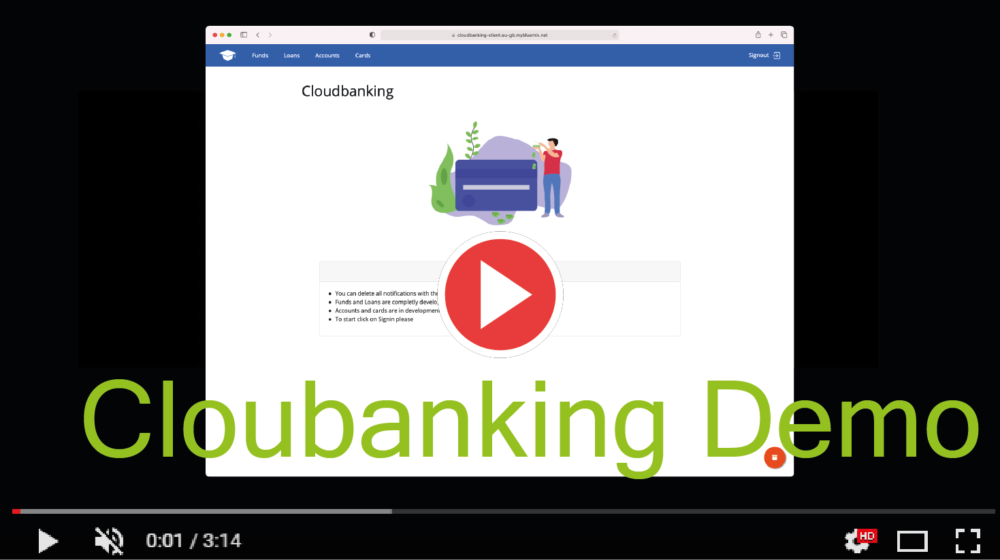

<head>
<link rel="shortcut icon"
    href="https://raw.githubusercontent.com/pepitoenpeligro/cloudbanking/master/docs/img/favicon.ico">
 </head>

# Cloud Banking
<br />
<br />


<div align="center">

<!-- ALL-CONTRIBUTORS-BADGE:START - Do not remove or modify this section -->
[](#contributors-)
<!-- ALL-CONTRIBUTORS-BADGE:END -->
:warning: **The development of the project is under construction**

</div>

<br />
<br />
<br />


<div align="center">

<table>
<thead>
  <tr>
    <th>CI/CD System</th>
    <th>Status</th>
  </tr>
</thead>
<tbody>
  <tr>
    <td>Travis</td>
    <td></td>
  </tr>
  <tr>
    <td>Circle Ci</td>
    <td></td>
  </tr>
  <tr>
    <td>GithubAction - Test</td>
    <td></td>
  </tr>
  <tr>
    <td>Drone.io</td>
    <td></td>
  </tr>
  
  <tr>
    <td>Azure Pipelines</td>
    <td>
    
    </td>
  </tr>
</tbody>
</table>

</div>

<br />
<br />
<br />
<br />
<br />
<br />


## Product Demo

<!-- <video
src="https://user-images.githubusercontent.com/14912971/106923621-914edd80-670e-11eb-9827-664ad9663bc1.mp4">
</video> -->

[](https://user-images.githubusercontent.com/14912971/106923621-914edd80-670e-11eb-9827-664ad9663bc1.mp4)

<br />
<br />
<br />
<br />
<br />


## [0. Composing and Continuous Deployment](https://pepitoenpeligro.github.io/cloudbanking/docs/6/1)

<p align="center">
  
</p>


* [R1-R2-R3-R4-R5](https://pepitoenpeligro.github.io/cloudbanking/docs/6/1)


##### Nginx endpoints Https

2. `https://pepecordoba.site:443/accounts`
3. `https://pepecordoba.site:443/cards`
4. `https://pepecordoba.site:443/funds`
5. `https://pepecordoba.site:443/loans`

##### Nginx endpoints Http
2. `http://pepecordoba.site:80/accounts`
3. `http://pepecordoba.site:80/cards`
4. `http://pepecordoba.site:80/funds`
5. `http://pepecordoba.site:80/loans`


##### React Client
- [https://cloudbanking-client.eu-gb.mybluemix.net](https://cloudbanking-client.eu-gb.mybluemix.net)

> All documentation can be found here: [https://pepitoenpeligro.github.io/cloudbanking/docs/6/1](https://pepitoenpeligro.github.io/cloudbanking/docs/6/1)

***

<br />
<br />


## [1. Wiki Section](https://github.com/pepitoenpeligro/cloudbanking/wiki)

<p align="center">
  
</p>


* Do you want to know how you can interact with each of the microservices?
* Do you want to know which routes are available?
* Do you want to know what parameters and bodies they accept?
* Do you want to know how to deploy microservices and bring them into production?

> For this, we have created a wiki section that can be consulted here: [CloudBanking Wiki](https://github.com/pepitoenpeligro/cloudbanking/wiki) or by clicking on the title of this section 

***

<br />
<br />
<br />


## [2. Roadmap - UPDATED](https://pepitoenpeligro.github.io/cloudbanking/docs/roadmap)


<p align="center">
  
</p>

Do you want to see the development planning of this project with the short and long term objectives?


> If yes, you only need to click on the title of this section

***


<br />
<br />
<br />

## [3. Documentation - UPDATED](https://raw.githack.com/pepitoenpeligro/cloudbanking/master/docs/documentation/cloudbanking/index.html)

<p align="center">
  
</p>

> If yes, you only need to click on the title of this section
> 
<br />
<br />


<p align="center">
  
</p>

The complete documentation (online)  of API design is available on the [postman website](https://documenter.getpostman.com/view/13864499/TVzPoK3B)

***

<br />
<br />
<br />


## 4. Direct access to the sections

<p align="center">
  
</p>

* R1. [Frameworks](https://pepitoenpeligro.github.io/cloudbanking/docs/5/r1)
* R2. [Design, Routes, Testing and HU's](https://pepitoenpeligro.github.io/cloudbanking/docs/5/r2)
* R3. [Good practices applied](https://pepitoenpeligro.github.io/cloudbanking/docs/5/r3)
* R4 and R5. [Correctness and Additional work](https://pepitoenpeligro.github.io/cloudbanking/docs/5/r4-5)


***

<br />
<br />
<br />

## 5. Run and deploy

<p align="center">
  
</p>


```
docker-compose up
```

***

<br />
<br />
<br />

## 6. Contributors ✨

<p align="center">
  
</p>

<!-- ALL-CONTRIBUTORS-LIST:START - Do not remove or modify this section -->
<!-- prettier-ignore-start -->
<!-- markdownlint-disable -->
<div align="center">


<table>

  <tr>
  <td align="center"><a href="https://github.com/arturocs"><br /><sub><b>Arturo Cortés Sánchez</b></sub></a><br/><a href="https://github.com/pepitoenpeligro/cloudbanking/commits?author=arturocs" title="Tests">⚠️</a> <a href="https://github.com/pepitoenpeligro/cloudbanking/commits?author=arturocs" title="Code">💻</a></td>
     <td align="center"><a href="http://goo.gl/IlWG8U"><br /><sub><b>Juan Julián Merelo Guervós</b></sub></a><br /><a href="https://github.com/pepitoenpeligro/cloudbanking/commits?author=JJ" title="Tests">⚠️</a></td>
     
   </tr>

</table>

<!-- markdownlint-enable -->
<!-- prettier-ignore-end -->
<!-- ALL-CONTRIBUTORS-LIST:END -->

This project follows the [all-contributors](https://github.com/all-contributors/all-contributors) specification. Contributions of any kind welcome!
</div>

***

<br />
<br />
<br />

## 7. Previous work done. Additional work

:checkered_flag: A technological feasibility study and the argument of the technologies finally proposed to be used in the project can be consulted at [Feasibility Study](https://pepitoenpeligro.github.io/cloudbanking/docs/feasibility-study)

:notebook: A description of the basic structure of this proyect can be found at [Basic Structure](https://pepitoenpeligro.github.io/cloudbanking/docs/proyect_structure)

:mag_right: The description of the problem can be found in [Problem-Description](https://pepitoenpeligro.github.io/cloudbanking/docs/problem-description)

:factory: A description of the architecture can be found at [Architecture Description](https://pepitoenpeligro.github.io/cloudbanking/docs/tecnology-architecture-description)

:warning: The previous step could be found in [H3](https://pepitoenpeligro.github.io/cloudbanking/docs/3/index-h3.md)

List of Animations
* https://lottiefiles.com/20054-gps-location-arrow
* https://lottiefiles.com/20298-code-loop
* https://lottiefiles.com/29693-team123
* https://lottiefiles.com/33369-sailing-ship
* https://lottiefiles.com/27556-african-teacher-or-instructor
* https://lottiefiles.com/14471-postbox