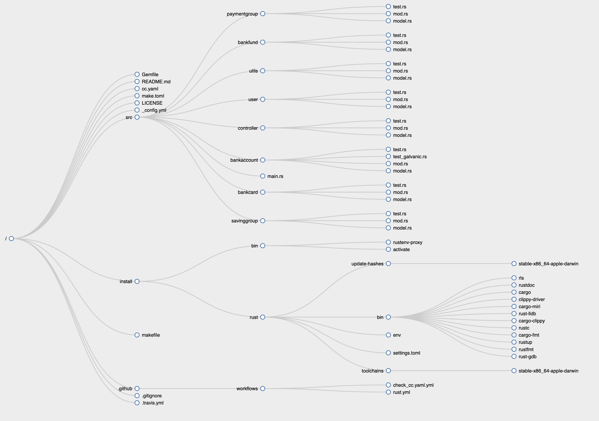

<head>
<link rel="shortcut icon"
    href="https://raw.githubusercontent.com/pepitoenpeligro/cloudbanking/master/docs/img/favicon.ico">
 </head>

# Cloud Banking :euro:


<!-- ALL-CONTRIBUTORS-BADGE:START - Do not remove or modify this section -->
[](#contributors-)
<!-- ALL-CONTRIBUTORS-BADGE:END -->

<br />
<br />
<br />

<div align="center">

| CI/CD system          	| Status 	|
|-----------------------	|-------:	|
| *Travis*              	| [](https://travis-ci.com/pepitoenpeligro/cloudbanking)|
| *Circle CI*           	| [](https://github.com/pepitoenpeligro/cloudbanking)|
| *GitHubAction - Test* 	|  |
| *Drone.io*            	| [](https://cloud.drone.io/pepitoenpeligro/cloudbanking)|
| *Azure Pipelines*     	| [](https://dev.azure.com/joseantcg/cloudbanking/_build/latest?definitionId=1&branchName=master) |

</div>

<br />
<br />
<br />


## [1. Wiki Section](https://github.com/pepitoenpeligro/cloudbanking/wiki)

<p align="center">
  
</p>


* ¿Quieres saber cómo se puede interaccionar con cada uno de los microservicios ?
* ¿Quieres saber qué rutas están disponibles? 
* ¿Quieres saber qué parámetros y cuerpos aceptan?
* Do you want to know how to deploy microservices and bring them into production?

For this, we have created a wiki section that can be consulted here: [CloudBanking Wiki](https://github.com/pepitoenpeligro/cloudbanking/wiki)


:warning: **The development of the project is under construction**

----

:bookmark_tabs: Source Code Documentation of this proyect is available in [cloudbanking Docs](https://raw.githack.com/pepitoenpeligro/cloudbanking/master/docs/documentation/cloudbanking/index.html)


----

:oncoming_bus: A Roadmap can be found at [Roadmap](https://pepitoenpeligro.github.io/cloudbanking/docs/roadmap)

:bookmark_tabs: The list of tasks and the status of the project can be found at [Project Plan](https://github.com/pepitoenpeligro/cloudbanking/projects/1)

---

## Project Structure




---

## Direct access to the sections

* R1. [Why CI?. Travis](https://pepitoenpeligro.github.io/cloudbanking/docs/4/r1)
* R2. [Other CI systems](https://pepitoenpeligro.github.io/cloudbanking/docs/4/r2)
* R3. [Using Tasks Manager in CI](https://pepitoenpeligro.github.io/cloudbanking/docs/4/r3)
* R4. [Using Docker Image in CI](https://pepitoenpeligro.github.io/cloudbanking/docs/4/r4)
* R5. [Code and Test advance. Other additional work](https://pepitoenpeligro.github.io/cloudbanking/docs/4/r4)


## Compile project and run

:surfer: The project can __be compiled__ without errors as indicate the badges: 

[](https://travis-ci.com/pepitoenpeligro/cloudbanking)


```
cargo build
cargo run
```


## References :books:
* [Rust](https://www.rust-lang.org)
* [warp](https://github.com/seanmonstar/warp)
* [serde](https://github.com/serde-rs/serde)
* [parking_lot](https://github.com/Amanieu/parking_lot)
* [Emojis](https://gist.github.com/rxaviers/7360908)


## Previous work done

:checkered_flag: A technological feasibility study and the argument of the technologies finally proposed to be used in the project can be consulted at [Feasibility Study](https://pepitoenpeligro.github.io/cloudbanking/docs/feasibility-study)

:notebook: A description of the basic structure of this proyect can be found at [Basic Structure](https://pepitoenpeligro.github.io/cloudbanking/docs/proyect_structure)

:mag_right: The description of the problem can be found in [Problem-Description](https://pepitoenpeligro.github.io/cloudbanking/docs/problem-description)

:factory: A description of the architecture can be found at [Architecture Description](https://pepitoenpeligro.github.io/cloudbanking/docs/tecnology-architecture-description)

:warning: The previous step could be found in [H3](https://pepitoenpeligro.github.io/cloudbanking/docs/3/index-h3.md)
## Contributors ✨

Thanks goes to these wonderful people ([emoji key](https://allcontributors.org/docs/en/emoji-key)):

<!-- ALL-CONTRIBUTORS-LIST:START - Do not remove or modify this section -->
<!-- prettier-ignore-start -->
<!-- markdownlint-disable -->
<table>

  <tr>
  <td align="center"><a href="https://github.com/arturocs"><br /><sub><b>Arturo Cortés Sánchez</b></sub></a><br/><a href="https://github.com/pepitoenpeligro/cloudbanking/commits?author=arturocs" title="Tests">⚠️</a> <a href="https://github.com/pepitoenpeligro/cloudbanking/commits?author=arturocs" title="Code">💻</a></td>
     <td align="center"><a href="http://goo.gl/IlWG8U"><br /><sub><b>Juan Julián Merelo Guervós</b></sub></a><br /><a href="https://github.com/pepitoenpeligro/cloudbanking/commits?author=JJ" title="Tests">⚠️</a></td>
     
   </tr>

</table>

<!-- markdownlint-enable -->
<!-- prettier-ignore-end -->
<!-- ALL-CONTRIBUTORS-LIST:END -->

This project follows the [all-contributors](https://github.com/all-contributors/all-contributors) specification. Contributions of any kind welcome!