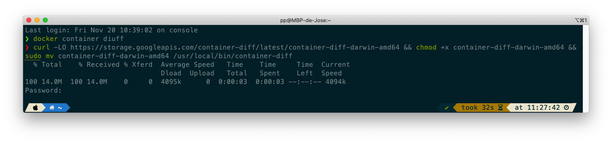
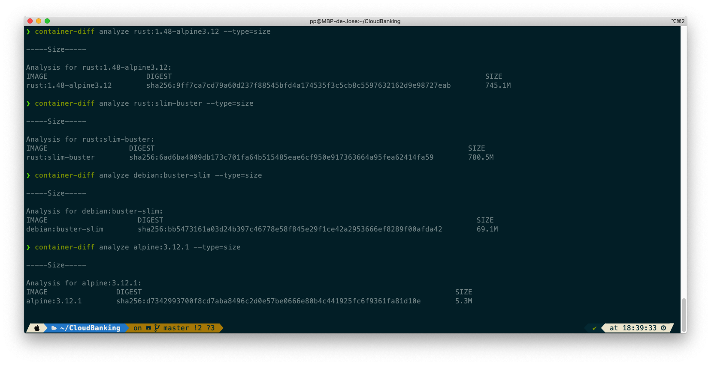
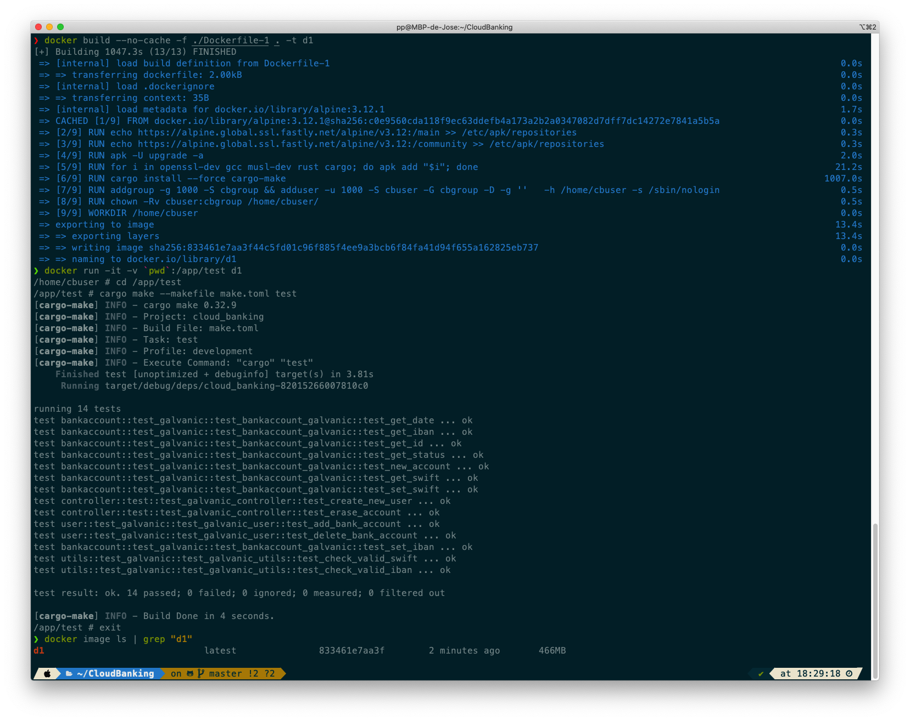
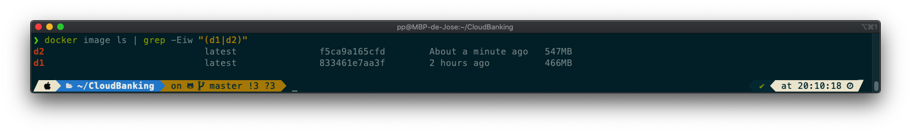

## Previous Context

First, [8 days before starting](https://github.com/pepitoenpeligro/CloudBanking/blob/f442820a3b80b01987d027ad943ca696fa9066af/Dockerfile) this project-stage, I decided to choose Alpine as the base image because it is the lightest (by default) and because it has support for Rust thanks to the implementation of the C library (MUSL) that Alpine comes with by default and with which Rust is compatible. 

My perspective was clearly to use the container to run my application. My point of view was that of execution. My point of view was not to use a container as an additional tool (for a DevOps) to test the application, so my goal was clearly to have the minimum size because PasS and IaaS charge for each Mb stored, and my goal is to reduce the infrastructure and operation costs as much as possible.

On November 18, I understood the need to define a Docker image to facilitate the testing of our application, so the work done so far is largely unhelpful, not being what is expected.

## Base Container. 

#### Vital aspects to take into account among the different base images

1. Image Size
2. Image File System
3. Apt - rpm - apk - dnf - yum packages
4. Internal Implementation of C Standard lib (glibc, musl, newlib, ...)

To analyze these aspects, Google has a free software tool called [GooglecontainerTools/container-diff](https://github.com/GoogleContainerTools/container-diff)

We install as follows:

```shell
curl -LO https://storage.googleapis.com/container-diff/latest/container-diff-darwin-amd64 && chmod +x container-diff-darwin-amd64 && sudo mv container-diff-darwin-amd64 /usr/local/bin/container-diff
```





It works as follows:

```shell
container-diff analyze <imageName> --type={size,file,apt,...}
```

To perform a diff analysis on two different images:

```shell
container-diff diff --json <imageOne> <imageTwo>
```


#### Options to Value

1. If we wanted to design a container image where to run our application, we could make use of *FROM scratch* and copy the binary (compiled for a specific architecture and statically linked all the necessary libraries). This is not the case, so we discard this option.
2. Take a base image of type *busybox* {uclibc, glibc, musl} containing basic Unix utilities It would not contain the package manager (to install new ones if needed). 
3. Use Alpine image. Alpine is a lightweight Linx distribution based on musl and busybox. It's a complete OS. It can be a good option.
4. Use a Standard (less) lightweight images like CentOs, Ubuntu or Debian in their slim versions. It can be a good option.
5. Use built-in image from Docker Hub like the official image from [rust](https://hub.docker.com/_/rust)


#### Analysis

- [x] rust:1.48-alpine3.12
- [x] rust:slim-buster
- [x] debian:buster-slim
- [x] alpine:3.12.1


Let's analyze by size, the different options that I value:

```shell
container-diff analyze rust:1.48-alpine3.12 --type=size
container-diff analyze rust:slim-buster --type=size
container-diff analyze debian:buster-slim --type=size
container-diff analyze alpine:3.12.1 --type=size
```



We discarded the two official Rust images as they weighed over 700MB. With the work done previously, we know that we can achieve much more optimal results in space.

Our options are limited to:

- [x] ~~rust:1.48-alpine3.12~~
- [x] ~~rust:slim-buster~~
- [x] debian:buster-slim
- [x] alpine:3.12.1


From the point of view of the packages they bring:

Debian:buster-slim

```shell
-adduser                       3.118                         849K
-apt                           1.8.2.1                       4M
-base-files                    10.3 deb10u6                  340K
-base-passwd                   3.5.46                        232K
-bash                          5.0-4                         6.3M
-bsdutils                      1:2.33.1-0.1                  293K
-coreutils                     8.30-3                        15.4M
-dash                          0.5.10.2-5                    212K
-debconf                       1.5.71                        520K
-debian-archive-keyring        2019.1                        198K
-debianutils                   4.8.6.1                       226K
-diffutils                     1:3.7-3                       1.5M
-dpkg                          1.19.7                        6.5M
-e2fsprogs                     1.44.5-1 deb10u3              1.4M
-fdisk                         2.33.1-0.1                    483K
-findutils                     4.6.0 git+20190209-2          1.9M
-gcc-8-base                    8.3.0-6                       248K
-gpgv                          2.2.12-1 deb10u1              837K
-grep                          3.3-1                         1014K
-gzip                          1.9-3                         243K
-hostname                      3.21                          54K
-init-system-helpers           1.56 nmu1                     133K
-libacl1                       2.2.53-4                      70K
-libapt-pkg5.0                 1.8.2.1                       3.2M
-libattr1                      1:2.4.48-4                    55K
-libaudit-common               1:2.8.4-3                     33K
-libaudit1                     1:2.8.4-3                     161K
-libblkid1                     2.33.1-0.1                    428K
-libbz2-1.0                    1.0.6-9.2~deb10u1             104K
-libc-bin                      2.28-10                       3.4M
-libc6                         2.28-10                       12M
-libcap-ng0                    0.7.9-2                       47K
-libcom-err2                   1.44.5-1 deb10u3              92K
-libdb5.3                      5.3.28 dfsg1-0.5              1.8M
-libdebconfclient0             0.249                         72K
-libext2fs2                    1.44.5-1 deb10u3              476K
-libfdisk1                     2.33.1-0.1                    546K
-libffi6                       3.2.1-9                       56K
-libgcc1                       1:8.3.0-6                     116K
-libgcrypt20                   1.8.4-5                       1.3M
-libgmp10                      2:6.1.2 dfsg-4                565K
-libgnutls30                   3.6.7-4 deb10u5               2.6M
-libgpg-error0                 1.35-1                        175K
-libhogweed4                   3.4.1-1                       245K
-libidn2-0                     2.0.5-1 deb10u1               280K
-liblz4-1                      1.8.3-1                       141K
-liblzma5                      5.2.4-1                       263K
-libmount1                     2.33.1-0.1                    475K
-libncursesw6                  6.1 20181013-2+deb10u2        411K
-libnettle6                    3.4.1-1                       380K
-libp11-kit0                   0.23.15-2                     1.3M
-libpam-modules                1.3.1-5                       1M
-libpam-modules-bin            1.3.1-5                       238K
-libpam-runtime                1.3.1-5                       1M
-libpam0g                      1.3.1-5                       244K
-libpcre3                      2:8.39-12                     673K
-libseccomp2                   2.3.3-4                       306K
-libselinux1                   2.8-1 b1                      194K
-libsemanage-common            2.8-2                         30K
-libsemanage1                  2.8-2                         301K
-libsepol1                     2.8-1                         724K
-libsmartcols1                 2.33.1-0.1                    314K
-libss2                        1.44.5-1 deb10u3              104K
-libstdc++6                    8.3.0-6                       2M
-libsystemd0                   241-7~deb10u4                 768K
-libtasn1-6                    4.13-3                        112K
-libtinfo6                     6.1 20181013-2+deb10u2        521K
-libudev1                      241-7~deb10u4                 259K
-libunistring2                 0.9.10-1                      1.6M
-libuuid1                      2.33.1-0.1                    120K
-libzstd1                      1.3.8 dfsg-3                  670K
-login                         1:4.5-1.1                     2.6M
-mawk                          1.3.3-17 b3                   183K
-mount                         2.33.1-0.1                    418K
-ncurses-base                  6.1 20181013-2+deb10u2        368K
-ncurses-bin                   6.1 20181013-2+deb10u2        616K
-passwd                        1:4.5-1.1                     2.5M
-perl-base                     5.28.1-6 deb10u1              9.9M
-sed                           4.7-1                         883K
-sysvinit-utils                2.93-8                        131K
-tar                           1.30 dfsg-6                   2.8M
-tzdata                        2020d-0 deb10u1               3M
-util-linux                    2.33.1-0.1                    4.2M
-zlib1g                        1:1.2.11.dfsg-1               174K
```

We can find many programs that we are not going to use like tzdata, login, adduser, dpkg, which take up space unnecessarily.

However alpine, only brings busybox.  Let's try with the minimal option, so we will try with Alpine.


##### Construction from scratch using an Alpine base image

First we create a volume to make the docker image container accessible, then our repository.

```
docker volume create volumeCloudBanking
volumeCloudBanking
```

We define the Dockerfile as follows:

```Dockerfile
# It provides containerisation to CloudBanking proyect.
# Containersitation it's a way of build a machine 
# and human readable script (similar to makefile)
# for creating a virtual infraestructure of data processing.

# Our infrastructure will be the result of abstracting and packaging 
# the language compiler/interpreter, the application-dependent
# programs and the system libraries needed to run a workflow.


# From Layer
# Should be first, if not: failed to solve with frontend dockerfile.v0: failed to create LLB definition: No build stage in current context
# Select image base {alpine, fedora, centos}
# We use Alpine image because is a complete Linux
# In only 5 MB package
FROM alpine:3.12.1


LABEL pepitoenpeligro.CloudBanking.version="0.4.0"
LABEL pepitoenpeligro.CloudBanking.release-date="2020-11-09"
LABEL mantainer="https://github.com/pepitoenpeligro"
LABEL pepitoenpeligro.label-CloudBanking.usage="https://pepitoenpeligro.github.io/CloudBanking/"
LABEL pepitoenpeligro.CloudBanking.url="https://hub.docker.com/r/pepitoenpeligro/cloudbanking/"
LABEL pepitoenpeligro.CloudBanking.description="Docker Alpine with CloudBanking"

ENV alpine_repo=https://alpine.global.ssl.fastly.net/alpine/v3.12


# Layer Run
# It makes possible to execute commands inside the Docker image
# Is like a shell script that contains the desired behaviour,
# similar a Shell Script

RUN echo $alpine_repo:/main >> /etc/apk/repositories
RUN echo $alpine_repo:/community >> /etc/apk/repositories
RUN apk -U upgrade -a 
RUN for i in openssl-dev  pkg-config gcc musl-dev rust cargo; do apk add "$i"; done
RUN cargo install --force cargo-make

USER root
RUN addgroup -g 1000 -S cbgroup && adduser -u 1000 -S cbuser -G cbgroup -D -g ''   -h /home/cbuser -s /sbin/nologin
RUN chown -Rv cbuser:cbgroup /home/cbuser/
WORKDIR /home/cbuser

# Layer CMD
# It makes posible to run process inside Docker Container.
# It defines what happens when Docker container has started.
USER cbuser
CMD /bin/sh
```




An image of 466 MB


Now we construct the debian based image:

```Dockerfile
# It provides containerisation to CloudBanking proyect.
# Containersitation it's a way of build a machine 
# and human readable script (similar to makefile)
# for creating a virtual infraestructure of data processing.

# Our infrastructure will be the result of abstracting and packaging 
# the language compiler/interpreter, the application-dependent
# programs and the system libraries needed to run a workflow.


# From Layer
# Should be first, if not: failed to solve with frontend dockerfile.v0: failed to create LLB definition: No build stage in current context
FROM debian:buster-slim


LABEL pepitoenpeligro.CloudBanking.version="0.4.0"
LABEL pepitoenpeligro.CloudBanking.release-date="2020-14-09"
LABEL mantainer="https://github.com/pepitoenpeligro"
LABEL pepitoenpeligro.label-CloudBanking.usage="https://pepitoenpeligro.github.io/CloudBanking/"
LABEL pepitoenpeligro.CloudBanking.url="https://hub.docker.com/r/pepitoenpeligro/cloudbanking/"
LABEL pepitoenpeligro.CloudBanking.description="Docker Debian with CloudBanking"


# Layer Run
# It makes possible to execute commands inside the Docker image
# Is like a shell script that contains the desired behaviour,
# similar a Shell Script
RUN apt-get update && apt-get  upgrade -y
RUN for i in openssl-dev libssl-dev rust cargo; do apt-get install "$i" -y; done
ENV PKG_CONFIG_PATH=/usr/lib/x86_64-linux-gnu/pkgconfig/
RUN cargo install --force cargo-make

USER root
RUN addgroup  -S cbgroup
RUN adduser -u 1000 -S cbuser -G cbgroup  -h /home/cbuser -s /sbin/nologin
RUN chown -Rv cbuser:cbgroup /home/cbuser/
WORKDIR /home/cbuser

# Layer CMD
# It makes posible to run process inside Docker Container.
# It defines what happens when Docker container has started.
USER cbuser
CMD /bin/sh
```



Since the images are equally functional, we prefer the smaller size, so the final choice is clear:


1. ~~*FROM scratch*~~.
2. ~~*busybox* containing basic Unix~~.
3. **Use Alpine image. Alpine is a lightweight Linx distribution based on musl and busybox.**
4. ~~Use a Standard (less) lightweight images like CentOs, Ubuntu or Debian ~~
5. ~~Use built-in image from Docker Hub like the official image from [rust](https://hub.docker.com/_/rust)~~

**So the final choice is clear: alpine:3.12.1 base image**


#### References
* [container-diff](https://github.com/GoogleContainerTools/container-diff)
* [BusyBox](https://es.wikipedia.org/wiki/Busybox)
* [BusyBox docker](https://hub.docker.com/_/busybox)