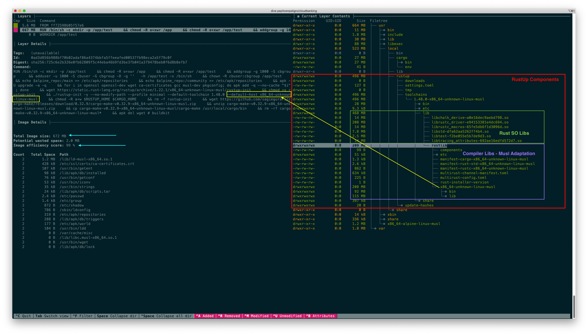
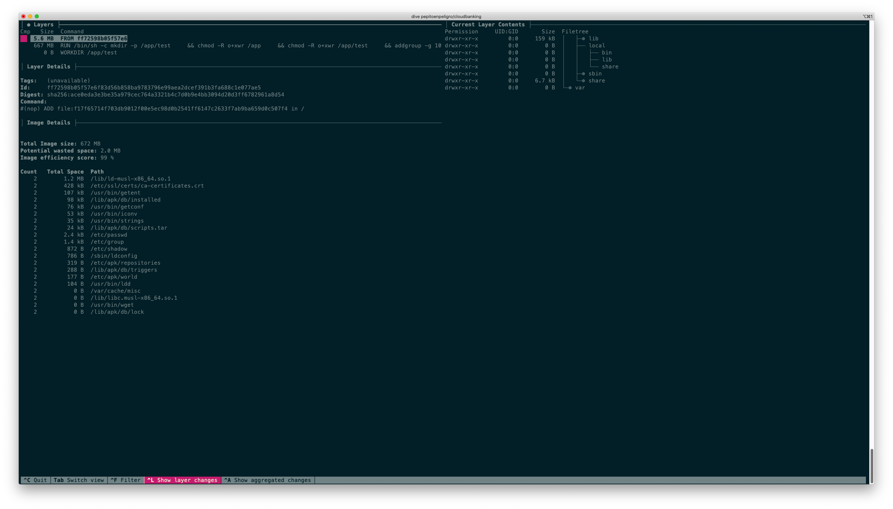
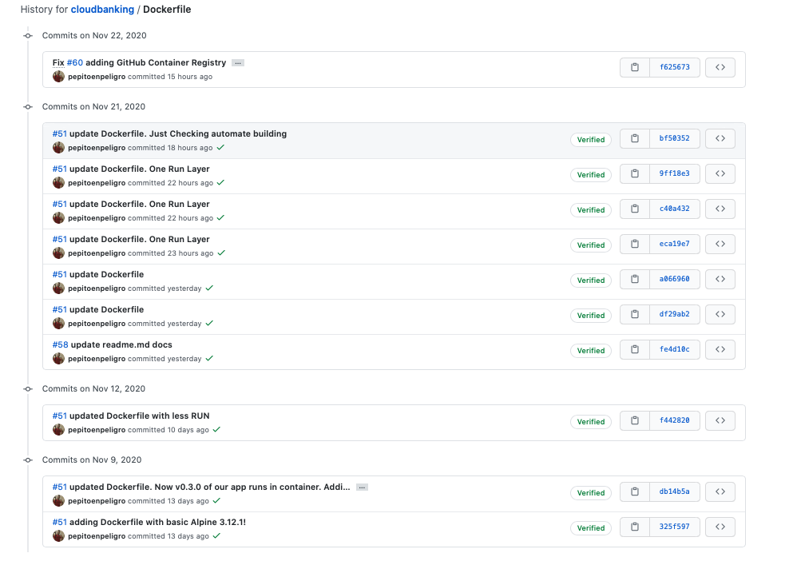
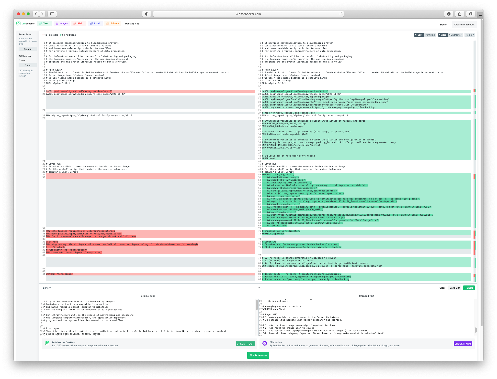

## Dockerfile

### Context
All work done it's described in [issue #51](https://github.com/pepitoenpeligro/cloudbanking/issues/51)


#### How do I validate if the Dockerfile is correct or not?

Let's create the image of the container and run it, so we can demonstrate the correctness of the Dockerfile.

```
cd cloudbanking
docker image ls | grep "cloudbanking"
docker build --no-cache -t pepitoenpeligro/cloudbanking .
docker run -t -v `pwd`:/app/test -t pepitoenpeligro/cloudbanking
```


** Correct Dockerfile ** : :heavy_check_mark:


## Good practices applied

1. Minimize the number of layers (Reference 3,4,5)
   - Compress **All** _RUN layers_ in **one** _RUN layer_. 
2. **Avoid using copy**. We make the container expandable in a dynamic way (at the time of execution) by mounting the directory of our project (_pwd_) in a fixed location of the container (_/app/test_). (Reference 3,5)
3. **Take a lightweight base image**. In our case we use Alpine. It weighs 5.6 MB as can be seen in the screenshots from the layer analysis below this list.
4. Use project and image identification tags, such as creator, date, version and remote vcs. (Reference 4,5)
5. **Use a specific version of the base image**, and dispense with the use of _latest_. This ensures future reproducibility, because if something changes in alpine in the next version, it will not affect our image.
6. **Installation of a specific version of Rustup** and therefore of rustc, cargo and task manager. This ensures us the reproducibility of the image in the future. This is very convenient with Rust because this language allows the installation of previous versions (not very transparent) and where there are certain libraries that do not update at the same speed as the main compiler and stop working as expected.
7. **Execution of our container as a standard user** and not as a privileged user. This behavior can be modified if at run time we add the `--user=root` option.
8. **Erase what I don't need**. Rustup installation scripts, task manager scripts and packages that are not needed are removed once the image is ready for our purpose. (Reference 7 - De Ballena a Gallopedro)
9. **Install packages (apk) without saving anything in the cache**, using `apk add --no-cache <package>` (Reference 7 - De Ballena a Gallopedro)

Here we examinate each layer and it's content with `dive`. Please take a look here to understand the final size and the musl-compilation done.


Here we show the size of alpine from layer:



** Following good practices ** : :heavy_check_mark:
** Adapted to our project environment ** : :heavy_check_mark:
** Size Optimization ** : :heavy_check_mark:


#### History



Diff <firstVersion,Now>:



## References
* [1. Configuring Open SSL Rust](https://docs.rs/openssl/0.10.16/openssl/#automatic)
* [2. Good Practices Building Dockerfiles](https://docs.docker.com/develop/develop-images/dockerfile_best-practices/)
* [3. Best Practices](https://www.docker.com/blog/intro-guide-to-dockerfile-best-practices/)
* [4. Good Practices Refactoring Dockerfiles](https://www.replicated.com/blog/refactoring-a-dockerfile-for-image-size/)
* [5. Speeding up Rust Docker Builds](http://whitfin.io/speeding-up-rust-docker-builds/)
* [6. Docker prune](https://stackoverflow.com/questions/30604846/docker-error-no-space-left-on-device)
* [7. De Ballena a Gallopedro](https://github.com/erseco/dockerfile-optimization-examples/blob/master/Charla%20Docker%20-%20esLibre%20-%20Junio%202019.pdf)
