## Alternative container registries


### Azure Container Registry

We start from the basis of having the azure-cli and a group of resources with an associated active billing method. First we create a record to our resource group:


```
az acr create --resource-group pepitoHaceCloudComputing --name pepitoregistry -sku Basic
```
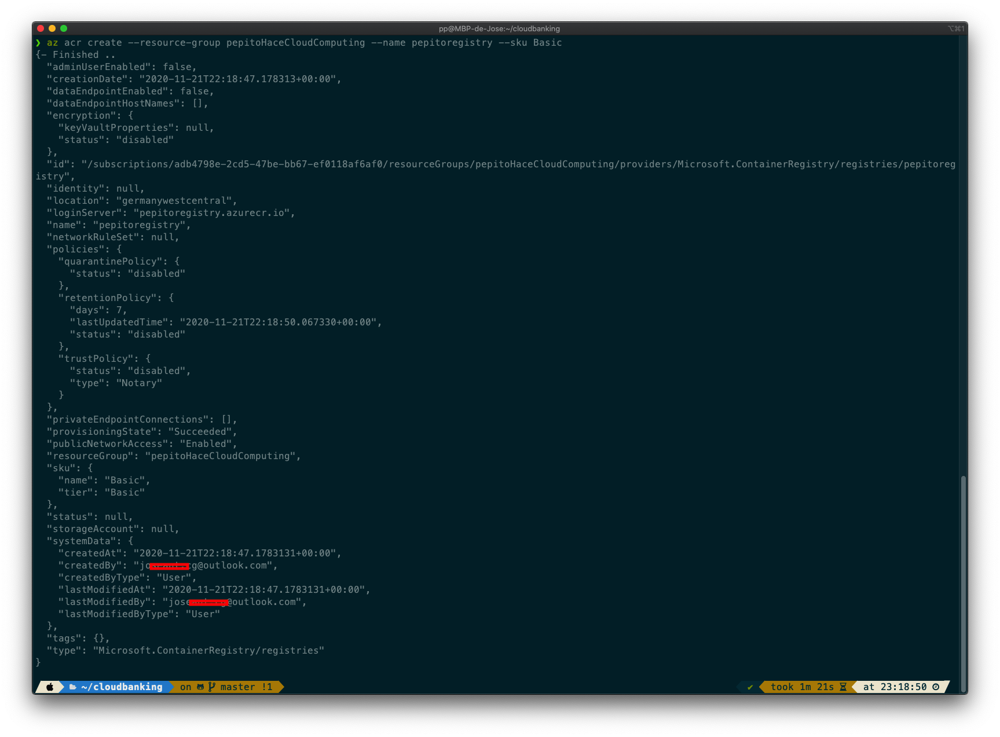

We check in the azure portal that the record has been created correctly. 


We log in to manage the registry, create an image tag and upload our image to the registry (private)


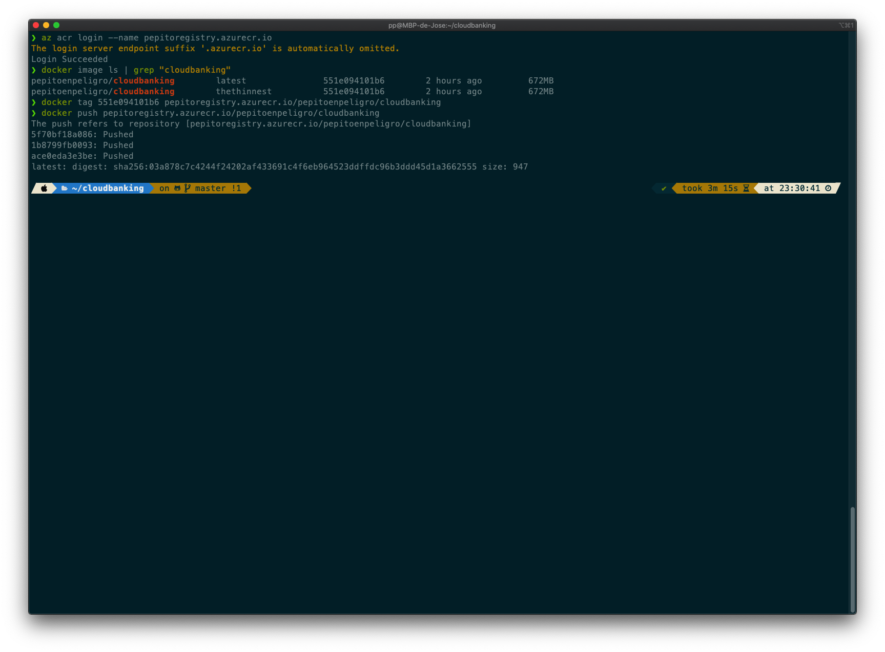


We modify the networking rules of our registry:
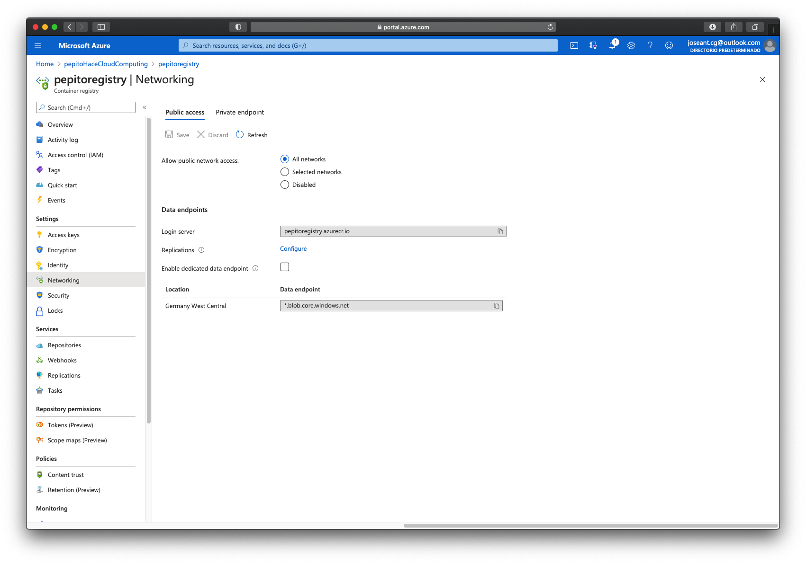


We check that we can make use of this image from the registry.
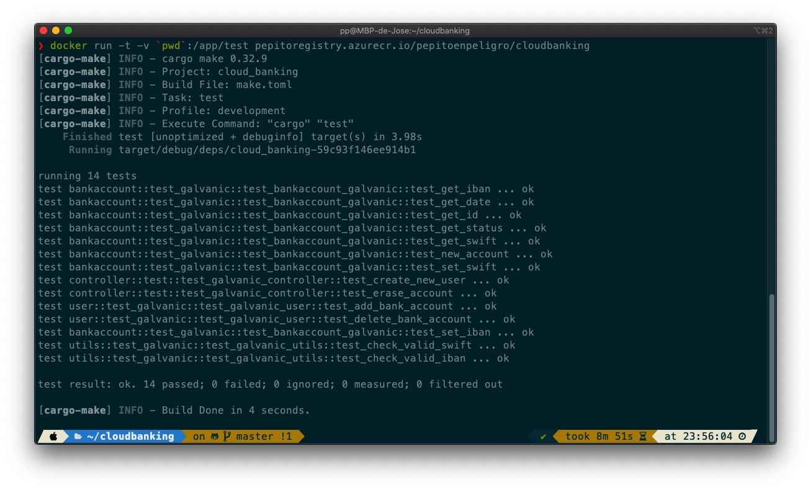


### GitHub Container Registry

First we need to create a new GitHubToken:

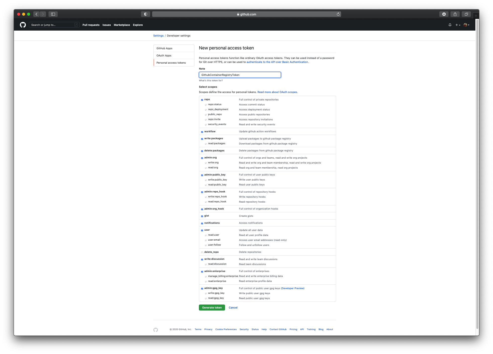
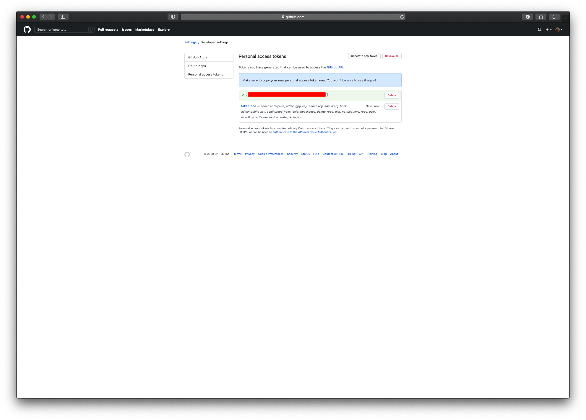

We activate the container plugin for github repository from "new features":

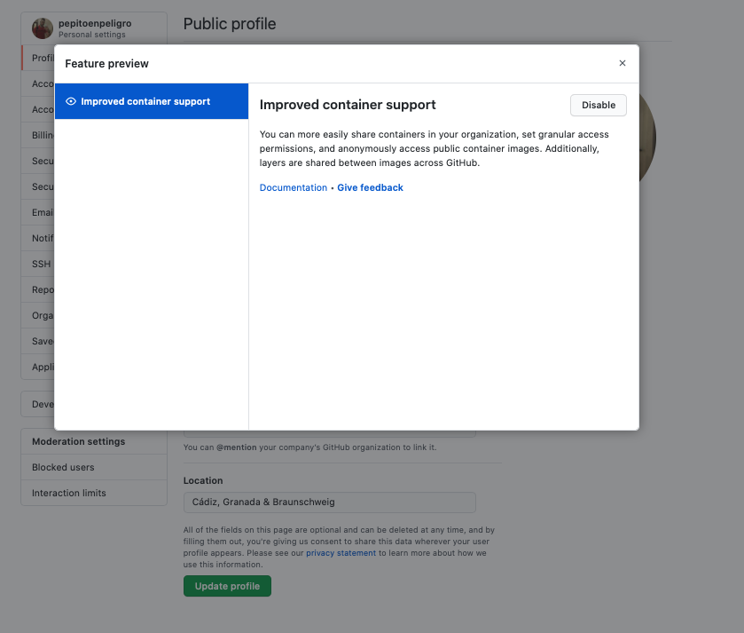


Now we are able to login, tag and push

```
echo $MY_GITHUB_PAT | docker login ghcr.io --username pepitoenpeligro --password-stdin
docker image ls | grep "cloudbanking"
docker tag <imageID> ghcr.io/pepitoenpeligro/cloudbanking
docker push ghcr.io/pepitoenpeligro/cloudbanking
```

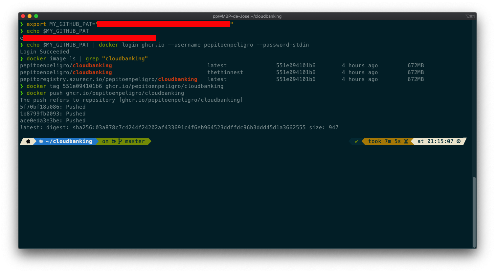

Now it's accesble from our repository home page:

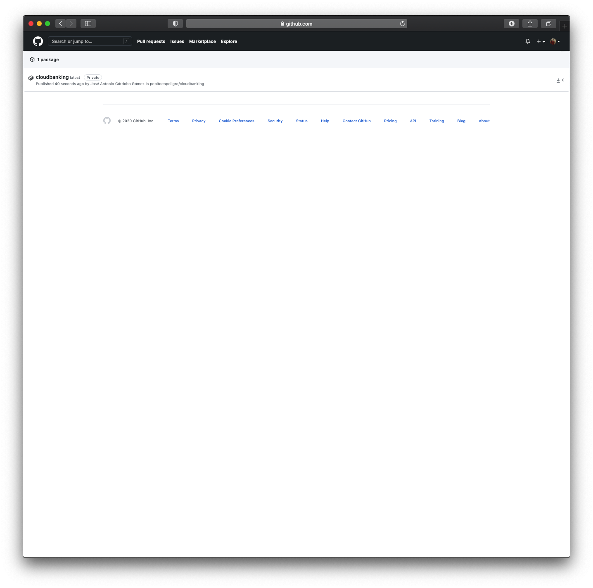
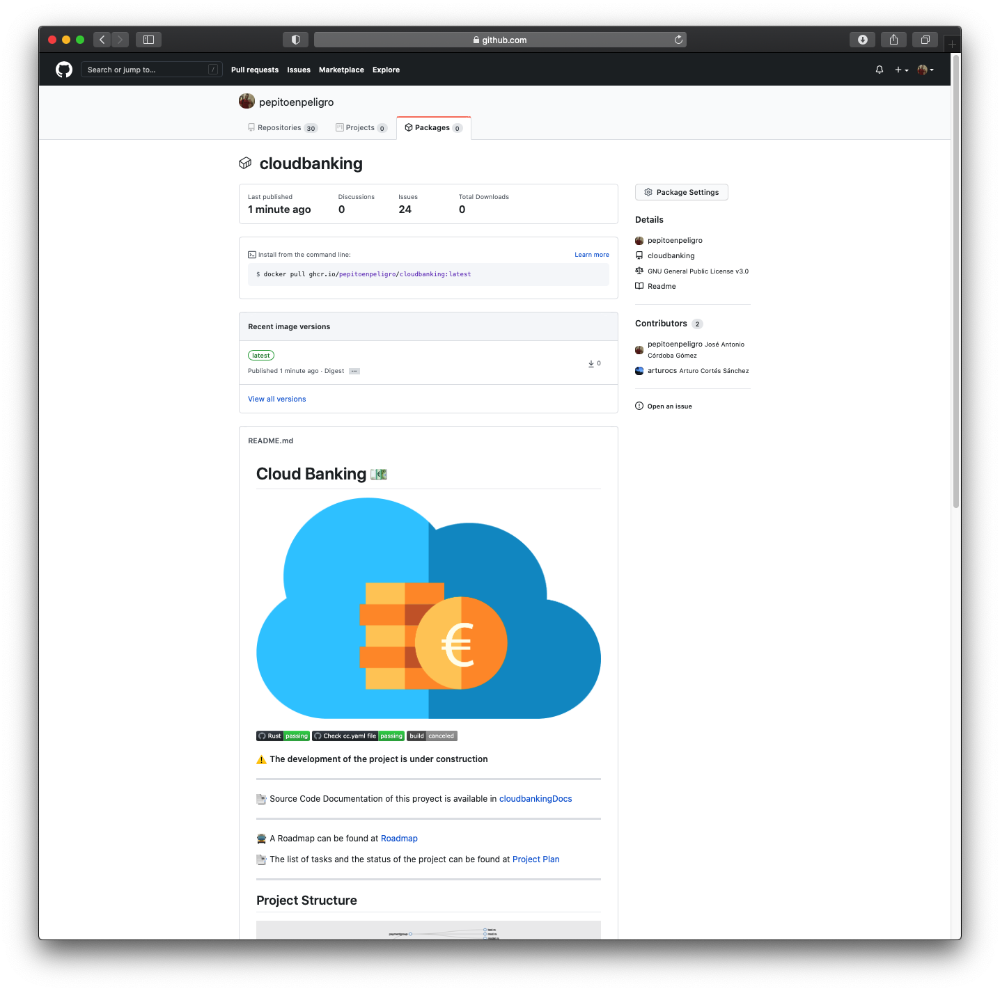

We are able now to make public our image from ghrc.io:

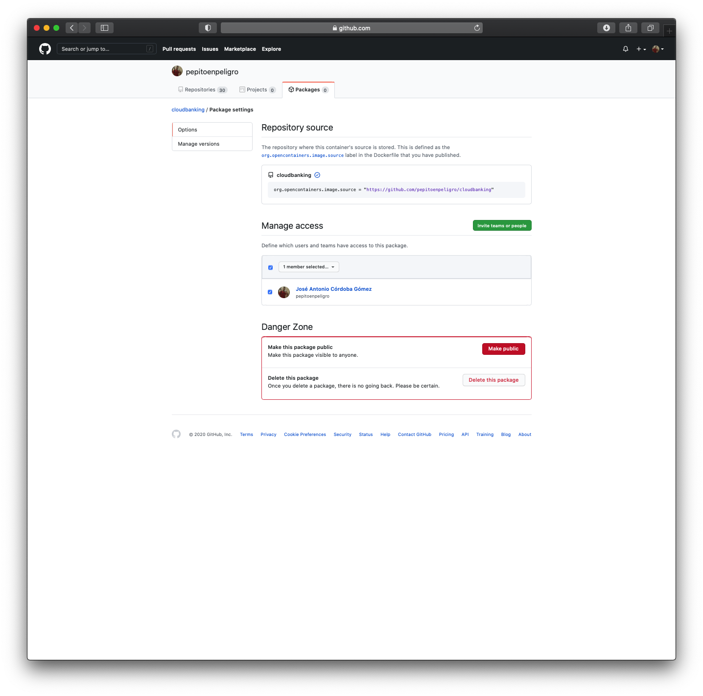
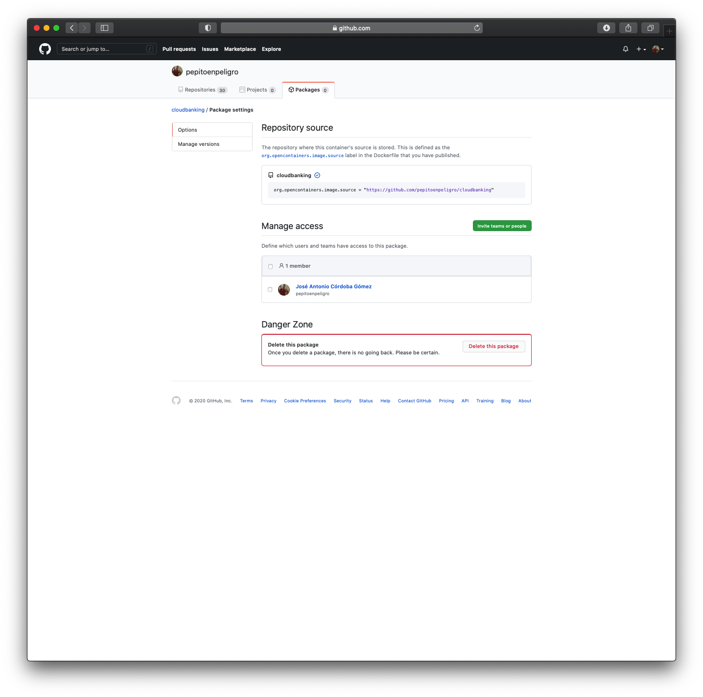

Now it's added to our repository home page:
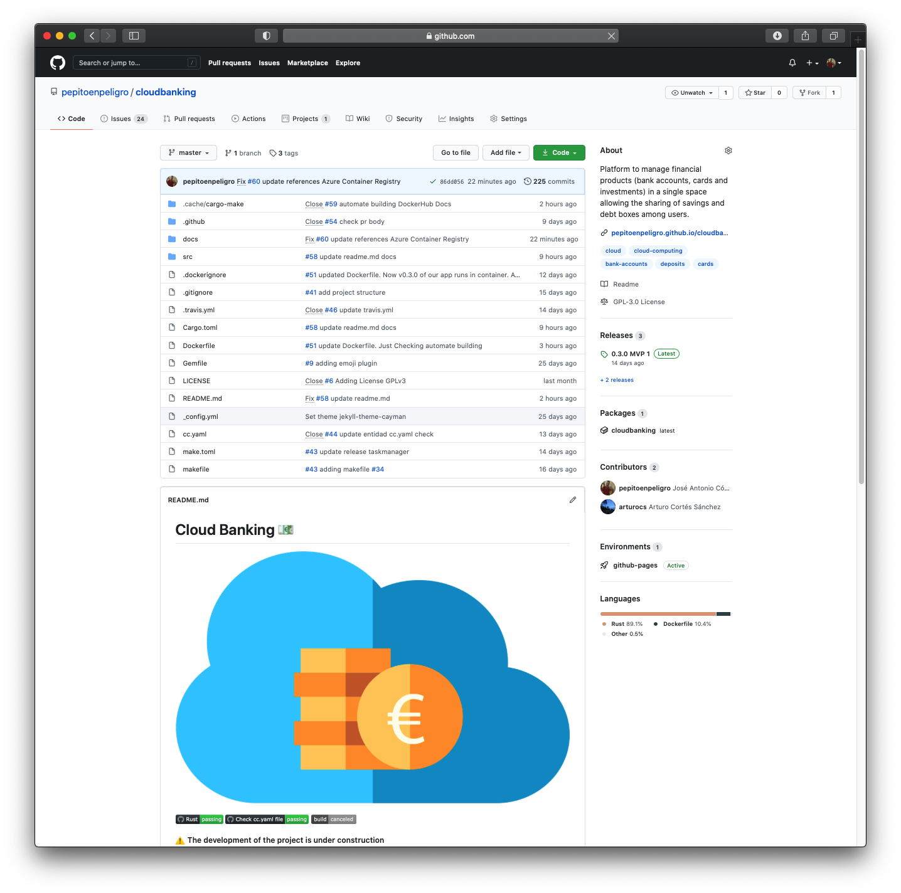


#### References
- [Craete Azure Registry](https://docs.microsoft.com/es-es/azure/container-registry/container-registry-get-started-azure-cli)
- [Login Azure Registry](https://docs.microsoft.com/es-es/azure/app-service/deploy-container-github-action?tabs=publish-profile)
- [Public Registry](https://docs.microsoft.com/es-es/azure/container-registry/container-registry-access-selected-networks)
- [Starting GHCR](https://docs.github.com/es/free-pro-team@latest/packages/getting-started-with-github-container-registry)
- [GHCR](https://docs.github.com/es/free-pro-team@latest/packages/getting-started-with-github-container-registry/core-concepts-for-github-container-registry)
- [Docker GHRC GithubAction](https://www.docker.com/blog/docker-support-for-the-new-github-container-registry/)
- [Compare Amazon ECR, Docker Hub and GitHub Container Registry](https://cloudonaut.io/amazon-ecr-vs-docker-hub-vs-github-container-registry/)
