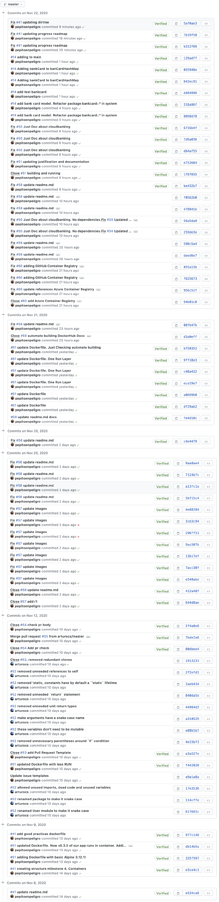
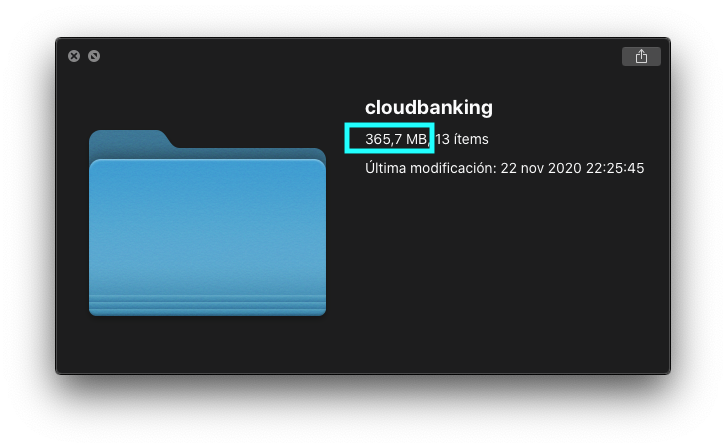
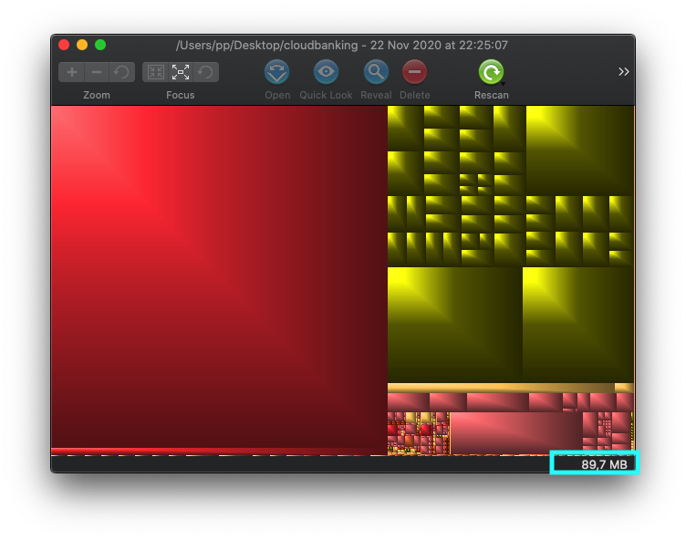
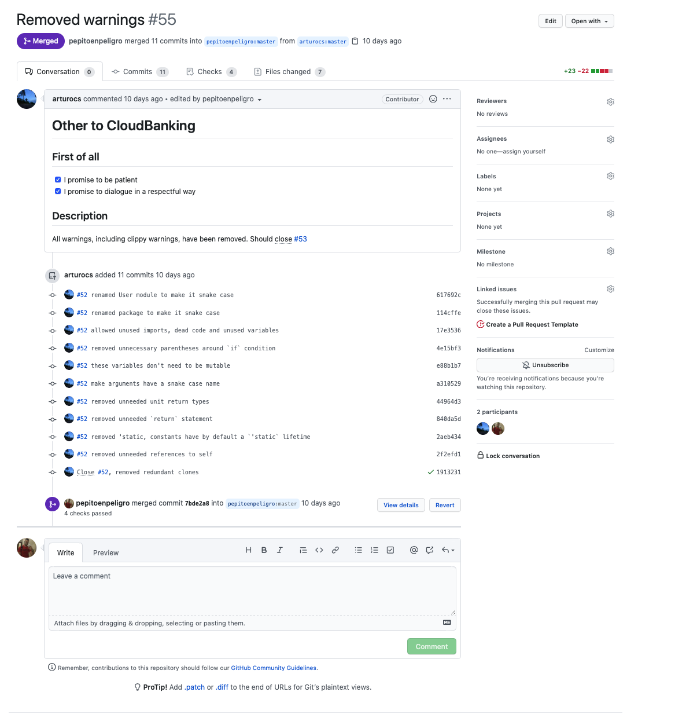

#### Advance of the code
* [Creating the Card model](https://github.com/pepitoenpeligro/cloudbanking/blob/master/src/bankcard/model.rs) 
* [Testing of the Card model](https://github.com/pepitoenpeligro/cloudbanking/blob/master/src/bankcard/test_galvanic.rs)
* [Verification of the type of card (Mastercard)](https://github.com/pepitoenpeligro/cloudbanking/blob/master/src/utils/model.rs)
* [Testing type of card](https://github.com/pepitoenpeligro/cloudbanking/blob/master/src/utils/test_galvanic.rs)
* [Adding a card to a user](https://github.com/pepitoenpeligro/cloudbanking/blob/master/src/user/model.rs)
* [Testing adding card to user](https://github.com/pepitoenpeligro/cloudbanking/commit/055948e7e7a39da3f03c92b697586072bc6e3b72?branch=055948e7e7a39da3f03c92b697586072bc6e3b72&diff=unified)
* [Removing a card to a user](https://github.com/pepitoenpeligro/cloudbanking/blob/master/src/user/model.rs)
* [Testing adding card to user](https://github.com/pepitoenpeligro/cloudbanking/commit/055948e7e7a39da3f03c92b697586072bc6e3b72?branch=055948e7e7a39da3f03c92b697586072bc6e3b72&diff=unified)


#### Amount Work Invested




#### Shrink GitHub Repository and blobl story

```
bfg -b 15M
git reflog expire --expire=now --all
git gc --prune=now --aggressive
```




#### PR closed and accepted

