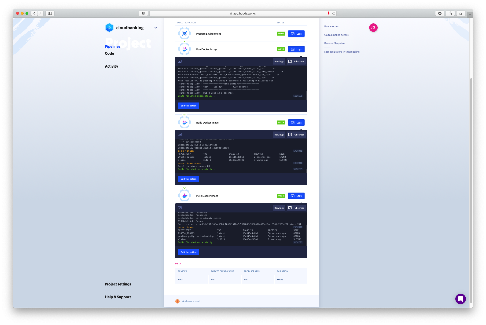

# Using our docker image in CI systems


We use our docker image, running it exactly as the travis test from the previous delivery, in Buddy.

The key to the execution is in the node:
```yaml
    volume_mappings:
    - "/:/app/test"
```

```yaml
- pipeline: "TestInDocker"
  #When Buddy runs this pipeline
  trigger_mode: "ON_EVERY_PUSH"
  ref_name: "master"
  ref_type: "BRANCH"
  # In free plan, only normal is possible.
  priority: "NORMAL"
  fail_on_prepare_env_warning: true
  trigger_condition: "ALWAYS"
  actions:
  - action: "Run Docker Image"
    type: "RUN_DOCKER_CONTAINER"
    # Docker image in DockerHub
    docker_image_name: "pepitoenpeligro/cloudbanking"
    # Tag (We can try with thethinnest)
    docker_image_tag: "latest"
    # Where to mount
    volume_mappings:
    - "/:/app/test"
    trigger_condition: "ALWAYS"
    ignore_image_pull_failures: true
    shell: "SH"
```


We take advantage of this system to configure the creation of a docker image automatically and its upload to dockerhub:


```yaml
- pipeline: "TestInDocker"
  trigger_mode: "ON_EVERY_PUSH"
  ref_name: "master"
  ref_type: "BRANCH"
  priority: "NORMAL"
  fetch_all_refs: true
  fail_on_prepare_env_warning: true
  trigger_condition: "ALWAYS"
  actions:
  - action: "Run Docker Image"
    type: "RUN_DOCKER_CONTAINER"
    docker_image_name: "pepitoenpeligro/cloudbanking"
    docker_image_tag: "latest"
    volume_mappings:
    - "/:/app/test"
    trigger_condition: "ALWAYS"
    ignore_image_pull_failures: true
    shell: "SH"
  - action: "Build Docker image"
    type: "DOCKERFILE"
    dockerfile_path: "Dockerfile"
    trigger_condition: "ALWAYS"
  - action: "Push Docker image"
    type: "DOCKER_PUSH"
    login: "pepitoenpeligro"
    password: "secure!RROQErbo/bNw0Ls8xyuEwg==.iJizlgqQlqNtn5th2tyMcQ=="
    docker_image_tag: "latest"
    repository: "pepitoenpeligro/cloudbanking"
    trigger_condition: "ALWAYS"
```

