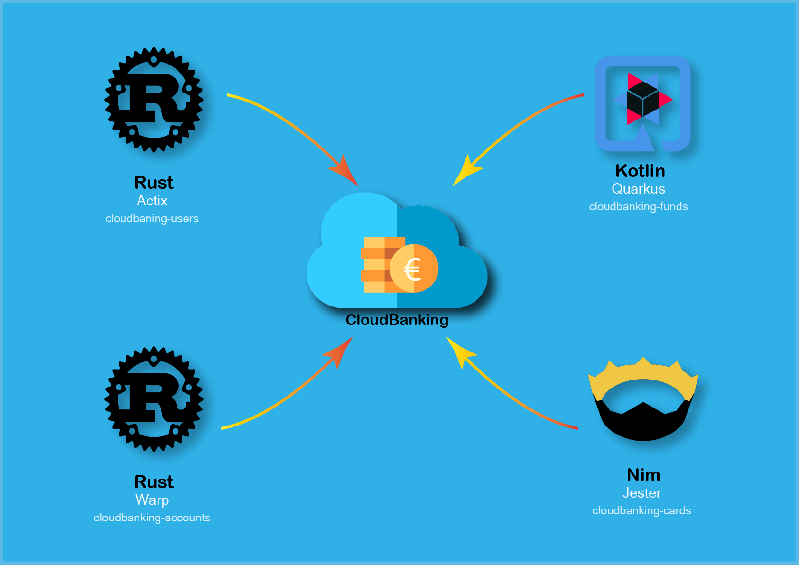

# R2. Design, Routes, Testing and HU's

The entire learning history about the design of the different "APIs" can be found in the [issue 71](https://github.com/pepitoenpeligro/cloudbanking/issues/71)

The proposed design, as discussed in the previous section, is based on four microservices programmed in different languages and with different frameworks. This gives us a practical view of the polyglot property of the microservices, and the capacity for interoperability that exists.



[Postman Documentation API](https://documenter.getpostman.com/view/13864499/TVzPoK3B)


#### Microservice 1:  Users 

*This microservice has been developed with Rust and the actix framework*


| Request route | Response | HU |
|:---|:---:|---:|
| GET       /api/users        | 200 OK always. It returns the list of all (active) users in cloudbanking | Basic CRUD function |
| GET       /api/users/{id}   | 200 OK if there is a user with this id. 404 Not Found if there is no user with that id in the system| Basic CRUD function |
| POST      /api/users        | 201 CREATED if post body is correct. If not, middleware returns 400 Bad Request indicating a bad formed body| [HU 14](https://github.com/pepitoenpeligro/cloudbanking/issues/26) |
| PUT       /api/users        | 201 CREATED if put body is correct. If not, middleware return 400 Bad Request indicating a bad formed body| Basic CRUD function |
| DELETE    /api/users/{id}   | 200 OK if there is a user with this id. 404 Not Found if there is no user with that id in the system| [HU 16](https://github.com/pepitoenpeligro/cloudbanking/issues/28) |

We can see the definition of the paths in the following code fragment that corresponds to the   [cloudbanking/src/main](https://github.com/pepitoenpeligro/cloudbanking/blob/master/src/main.rs)


```rust
let server = HttpServer::new(move   | | {
        App::new()

        // Injecting controller to service (api calls)
        .data(cbc.clone())

        // Defining Logger as middleware {INFO, DEBUG and ERROR} for actix-web logs
        .wrap(middleware::Logger::default())

        // Defining default Compress level for data exchange
        .wrap(middleware::Compress::new(ContentEncoding::Gzip))

        // Only accept GET, PUT, POST and DELETE verbs
        .wrap(middleware::DefaultHeaders::new().header("Access-Control-Allow-Methods", "GET, PUT, POST, DELETE"))

        // No access the site if detected XSS attempt. Not used now. WebBrowser needed
        .wrap(middleware::DefaultHeaders::new().header("X-XSS-Protection", "1; mode=block"))

        // We expect data exchange in only json format
        .wrap(middleware::DefaultHeaders::new().header("Content-Type", "application/json"))

        // Preventing to any website from embedding. Not used now. WebBrowser needed
        .wrap(middleware::DefaultHeaders::new().header("X-Frame-Options","Deny"))

        // What type of content and origin we will allo.
        .wrap(middleware::DefaultHeaders::new().header("Content-Security-Policy","script-src 'self'"))

        // Preventing CSRF attacks
        .wrap(middleware::DefaultHeaders::new().header("Access-Control-Allow-Headers", "X-Requested-Width"))
        // For restrict client with mandatory use of HTTPS 
        // .wrap(middleware::DefaultHeaders::new().header("Strict-Transport-Security","max-age=31536000; includeSubDomains"))


        // ROUTES
        // /api/users
        .service(web::scope("/api")

            // route GET /api/users
            .route("/users", web::get().to(get_users))

            // route POST /api/users
            .route("/users", web::post().to(add_user))

            // route GET /api/users/{id}
            .route("/users/{id}", web::get().to(get_user_by_id))

            // route DELETE /api/users/{id}
            .route("/users/{id}", web::delete().to(delete_user_by_id))
            
            // route PUT /api/users/{id}
            .route("/users/{id}",  web::put().to(update_user_by_id))

        )
        // /_ We can let it for static files
        .service(web::scope("/")
            .route("/healthcheck", web::get().to(healthcheck))
        )
    });

```

The function that handles the delete path (defined above) is shown below. The controller is injected over this handling function ```web::Data<Arc<RwLock<CloudBankingController>>>``` an object that represents the HTTP ```req: HttpRequest``` request and the parameter indicated in the path ```user_id: web::Path<String>```. 

```rust
pub async fn delete_user_by_id(_: CheckIdUserService, cbc: web::Data<Arc<RwLock<CloudBankingController>>>, req: HttpRequest, user_id: web::Path<String>) -> Result<HttpResponse, Error> {
    log::info!("Received request from uri: {}", req.uri());

    let users_in_system = cbc.read().unwrap().get_users().read().unwrap().to_owned();

    let user_id_key = user_id.as_str();
    println!("Searching user id in system: {} ",user_id_key );

    if users_in_system.contains_key(user_id_key) {
        log::info!("id is in system");    
        cbc.write().unwrap().erase_account(String::from(user_id_key));
        log::info!("user {} erased sucessfully", user_id_key);
        let mut mesg = Msg::new();
        mesg.msg = String::from("user deleted");
        return Ok(HttpResponse::Ok().json(mesg));

    }
    log::info!("user id is not in controller. Not possible to erase");
    let mut mesg = Msg::new();
    mesg.msg = String::from("It's not possible to erase user. User id not found. Please create user before search");
    return Ok(HttpResponse::NotFound().json(mesg));
    
}
```


To check that the route does what is required in the HU, we have designed a test. The tests for the rest of the methods have been done and you can check it here [cloudbanking/src/controller/routes_handlers.rs](https://github.com/pepitoenpeligro/cloudbanking/blob/master/src/controller/routes_handlers.rs)


Middleware for check id: [cloudbanking/src/controller/middleware.rs](https://github.com/pepitoenpeligro/cloudbanking/blob/master/src/controller/middleware.rs)

```rust
    /// DELETE /api/users
    /// Testing delete user from system 
    /// [HU 16] Erase Account
    #[actix_rt::test]
    async fn test_delete_user(){

        
        let id_user         : String                    = String::from("999f7f66abf88ee70243988");
        let email_user      : String                    = String::from("test_delete_user@ostfalia.de");
        let date_user       : NaiveDateTime             = NaiveDate::from_ymd(2020, 7, 8).and_hms(22, 18, 0);
        let user            : User                      = User::new(id_user,email_user,date_user);

        let req = test::TestRequest::post().uri("/api/users").set_json(&user).to_request();

        let cbc :Arc<RwLock<CloudBankingController>>  = Arc::new(RwLock::new(CloudBankingController::new()));

        let mut app = test::init_service(
            App::new()
    
            // Injecting controller to service (api calls)
            .data(cbc.clone())
    
            // Defining Logger as middleware {INFO, DEBUG and ERROR} for actix-web logs
            .wrap(middleware::Logger::default())
    
            // Defining default Compress level for data exchange
            .wrap(middleware::Compress::new(ContentEncoding::Gzip))
    
            // Only accept GET, PUT, POST and DELETE verbs
            .wrap(middleware::DefaultHeaders::new().header("Access-Control-Allow-Methods", "GET, PUT, POST, DELETE"))
    
            // No access the site if detected XSS attempt. Not used now. WebBrowser needed
            .wrap(middleware::DefaultHeaders::new().header("X-XSS-Protection", "1; mode=block"))
    
            // We expect data exchange in only json format
            .wrap(middleware::DefaultHeaders::new().header("Content-Type", "application/json"))
    
            // Preventing to any website from embedding. Not used now. WebBrowser needed
            .wrap(middleware::DefaultHeaders::new().header("X-Frame-Options","Deny"))
    
            // What type of content and origin we will allo.
            .wrap(middleware::DefaultHeaders::new().header("Content-Security-Policy","script-src 'self'"))
            // For restrict client with mandatory use of HTTPS 
            // .wrap(middleware::DefaultHeaders::new().header("Strict-Transport-Security","max-age=31536000; includeSubDomains"))
    
            // /api/users
            .service(web::scope("/api")
    
                // route GET /api/users
                .route("/users", web::get().to(get_users))
    
                // route POST /api/users
                .route("/users", web::post().to(add_user))
    
                // route GET /api/users/{id}
                .route("/users/{id}", web::get().to(get_user_by_id))
    
                // route DELETE /api/users/{id}
                .route("/users/{id}", web::delete().to(delete_user_by_id))
                
                // route PUT /api/users/{id}
                .route("/users/{id}",  web::put().to(update_user_by_id))
    
            )
            // /_ We can let it for static files
            .service(web::scope("/")
                .route("/healthcheck", web::get().to(healthcheck))
            )
        ).await;

        let resp = test::call_service(& mut app, req).await;
        println!("response from add user: {:?}", resp);
        assert!(resp.status().is_success());

        let my_uri = format!("/api/users/{}", user.get_id());
        let req = test::TestRequest::delete().uri(my_uri.as_str()).to_request();
        let nresp = test::call_service(& mut app, req).await;
        println!("response from delete user: {:?}", nresp);
        assert!(nresp.status().is_success());
    }
```


*** 


#### Microservice 2:  Bank Accounts 

*This microservice has been developed with Rust and the warp framework*

| Request route | Response | HU |
|:---|:---:|---:|
| GET       /accounts/{id}   | 200 OK if there is a bank account with this id. 404 Not Found if there is no account with that id in the system| Basic CRUD function |
| POST      /accounts        | 201 CREATED if post body is correct. (There is no middleware implemented for returning 400, this is considered future job)| [HU 1](https://github.com/pepitoenpeligro/cloudbanking/issues/13) |
| DELETE    /accounts/{id}   | 200 OK if there is a bank account with this id. 404 Not Found if there is no bank account with that id in the system| [HU 4](https://github.com/pepitoenpeligro/cloudbanking/issues/16) |


```rust
let mut control : BankAccountController = BankAccountController::new();
    let cbc_filter = warp::any().map(move | | control.clone());
    let socket : SocketAddr = SocketAddr::new(IpAddr::V4(Ipv4Addr::new(0, 0, 0, 0)), port.parse::<u16>().unwrap());

    let get_accounts = warp::get()
        .and(warp::path!("accounts" / String))
        .and(warp::path::end())
        .and(cbc_filter.clone())
        //.and(warp::path::param())
        .and_then(get_accounts_handler);


    // HU 1: Add Bank Account as customer user
    let add_accounts = warp::post()
        .and(warp::path("accounts"))
        .and(warp::path::end())
        .and(filter_json())
        .and(cbc_filter.clone())
        .and_then(add_accounts_handler);

    // HU 4: Erase bank account    
    let delete_account = warp::delete()
        .and(warp::path!("accounts" / String))
        .and(warp::path::end())
        .and(cbc_filter.clone())
        .and_then(delete_accounts_handler);

    let routes = get_accounts
                .or(add_accounts)
                .or(delete_account);
    
    warp::serve(routes).run(socket).await;
```

We can see the definition of the paths in the following code fragment that corresponds to the [cloudbanking/account/src/main.rs](https://github.com/pepitoenpeligro/cloudbanking/blob/master/account/src/main.rs)


Below is a fragment of a route management, where you can see that the procedure in which the controller is injected is exactly the same as with the previous framework

You can check all the routes in [cloudbanking/account/src/bankaccount_module/routes_handlers.rs](https://github.com/pepitoenpeligro/cloudbanking/blob/master/account/src/bankaccount_module/routes_handlers.rs)

```rust
pub async fn get_accounts_handler(id: String, mut bac: BankAccountController) -> Result<impl warp::Reply, warp::Rejection>{
    log::info!("[Get] /account/:id received -> get_accounts_handler");

    let result = bac.get_bank_accounts();
    let users = result.read().unwrap();

    // If there is at least 1 User
    if users.len() > 0 {
        let response = Ok(warp::reply::with_status(warp::reply::json(result), http::StatusCode::OK));
        println!("ok");
        log::info!("User returned successfully");
        return response;
    }else{
        let response = Ok(warp::reply::with_status(warp::reply::json(result), http::StatusCode::NOT_FOUND));
        log::info!("Error, there is no user with this id");
        return response;
    }
}
```


*** 


#### Microservice 3:  Bank Cards

*This microservice has been developed with Nim and the jester framework*


| Request route |  Response | HU |
|:---|:---:|---:|
| GET       /cards/{id}   | 200 OK if there is a card with this id. 404 Not Found if there is no card with that id in the system| Basic CRUD function |
| POST      /cards        | 201 CREATED if post body is correct. (There is no middleware implemented for returning 400, this is considered future job)| |
| DELETE    /cards/{id}   | 200 OK if there is a card with this id. 404 Not Found if there is no card with that id in the system| |


Below is the creation of the http server with the "jester" framework.


```nim
proc main() =
  var port:string = ""
  try:
    port = $etcdClientObj.get("PORT")
  except:
    echo("Could not found ETCD server")
  finally:
    echo("We are reading values from .env")
    let env = initDotEnv()
    env.load()

    port = os.getEnv("PORT")
    let settings = newSettings(port=port.parseInt().Port)
    var jester = initJester(cloudbankingCardsRoutes, settings=settings)
    jester.serve()

when isMainModule:
  main()
```

Now let's see how the routes have been made and how they have been handled. In this occasion, my inexperience with the language has made me impossible to separate the routes from the handlers (bad programming practice, I hope to learn in the near future).


```nim

router cloudbankingCardsRoutes:

  # Get a bank card by id
  get "/cards/@id":
    info("[GET] /cards/{id}")
    let paramReceived = @"id"
    let recoveredCard = controller.getBankCard(paramReceived)
    let idField = "" & recoveredCard.id;
    if idField == "-":
      error("Card not founded")
      resp(Http200, messageJson("Card not founded" & $(recoveredCard)), contentType="application/json")

    info("Card founded")
    resp(Http404, messageJson("Card founded: " & $(recoveredCard)), contentType="application/json")


  # HU 2: Create bank card
  post "/cards":
    info("[POST] /cards")
    let body = try: request.body.parseJson
               except: newJNull()

    if body.isNil:
      resp(Http400, messageJson("Invalid json"),
        contentType="application/json")

    let idjson : string = $ body["id"]
    let numberjson  : string = $ body["number"]
    let cvcjson : string = $body["cvc"];
    

    let newCard = Card(id: idjson,
                       number: numberjson,
                       cvc: cvcjson,
                       dateLimit: $ body["date_limit"],
                       status:  ($body["status"]).parseBool())

    let resultOperation = controller.addBankCard(newCard)
    if resultOperation:
      info("Card added successfully")
      resp(Http200,messageJson("Card added successfully"), contentType="application/json")
    else:
      error("Card NOT added successfully :" & ($resultOperation))
      resp(Http404,messageJson("Card NOT added successfully :" & ($resultOperation) ) , contentType="application/json")

  # HU 5: Delete bank card
  delete "/cards/@id":
    info("[GET] /cards/{id}")
    let paramReceived = @"id"
    let resultOperation: bool = controller.deleteBankCard(paramReceived)
    if resultOperation == true:
      info("Card was deleted successfully")
      resp(Http201, messageJson("Card was deleted successfully"), contentType="application/json")
    else: 
      error("Card was not found and not deleted")
      resp(Http404, messageJson("Card was not found and not deleted  successfully"  & ($resultOperation) ), contentType="application/json")
```


Router and handlers are here: [cloudbanking/card/src/jester_cards.nim](https://github.com/pepitoenpeligro/cloudbanking/blob/master/card/src/jester_cards.nim)


*** 


#### Microservice 4:  Bank Funds

*This microservice has been developed with Kotlin and the quarkus framework*


| Request route | Response |
|:---|:---:|---:|
| GET       /funds        | 200 OK always. It returns the list of all (active) funds in cloudbanking | Basic CRUD function |
| GET       /funds/{id}   | 200 OK if there is a fund with this id. 404 Not Found if there is no fund with that id in the system| Basic CRUD function |
| POST      /funds        | 201 CREATED if post body is correct. (There is no middleware implemented for returning 400, this is considered future job)| [HU 19](https://github.com/pepitoenpeligro/cloudbanking/issues/76) |
| DELETE    /funds/{id}   | 200 OK if there is a fund with this id. 404 Not Found if there is no fund with that id in the system| [HU 20](https://github.com/pepitoenpeligro/cloudbanking/issues/77) |


The definition of the entry point to the microservice, as well as the linkage to the handling functions, and the injection of dependencies (FundService) are shown below:


```kotlin

@Path("/")
@Produces(MediaType.APPLICATION_JSON)
@Consumes(MediaType.APPLICATION_JSON)
class FundResource {

    companion object {
        private val LOG = Logger.getLogger(FundResource::class.java)

    }

    @Inject
    @field: Default 
    lateinit var service: FundService

    // Get all funds
    @GET
    @Produces(MediaType.APPLICATION_JSON)
    @Path("/funds")
    fun list():  Set<Fund> {
        LOG.info("GET -> returning funds")
        return service.getFunds()
    }

    // Creates one funds
    @POST
    @Path("/funds")
    fun  add(f: Fund): Response {
        val result = service.addFund(f)
        if(result){
            LOG.info("POST -> Fund was created")
            var m  = Message("Created", "Fund was created");
            return Response.status(Response.Status.ACCEPTED).entity(m).build();
        }
        LOG.info("POST -> Fund was NOT created")
        var m  = Message("Not Created", "Fund was not created");
        return Response.status(Response.Status.BAD_REQUEST).entity(m).build();

    }

    // Deletes one funds
    @DELETE
    @Path("/funds/{id}")
    fun delete(@PathParam("id") id: String): Boolean{
        LOG.info("DELETE -> Fund was deleted")
        return service.deleteFund(id)
    }

}
```


And the definition and implementation of the service is shown below: 

```kotlin
@ApplicationScoped
class FundService {

    private val funds = Collections.newSetFromMap(Collections.synchronizedMap(LinkedHashMap<Fund, Boolean>()))


    fun greeting(name: String): String {
        return "hello $name"
    }

    fun addFund(f: Fund): Boolean{
        return funds.add(f)

    }


    fun getFunds(): Set<Fund>{
        return funds
    }

    fun deleteFund(id: String): Boolean{
        funds.removeIf {  existingFund:    Fund -> existingFund.id!!.contentEquals(id!!) }
        return true
    }


}
```


Service (injected), Handlers and Routes can be founded here: [cloudbanking/funds/src/main/kotlin/com/pepe/rest/resteasyjackson/FundResource.kt](https://github.com/pepitoenpeligro/cloudbanking/blob/master/funds/src/main/kotlin/com/pepe/rest/resteasyjackson/FundResource.kt)


*** 


The complete documentation (online) is available on the [postman website](https://documenter.getpostman.com/view/13864499/TVzPoK3B)