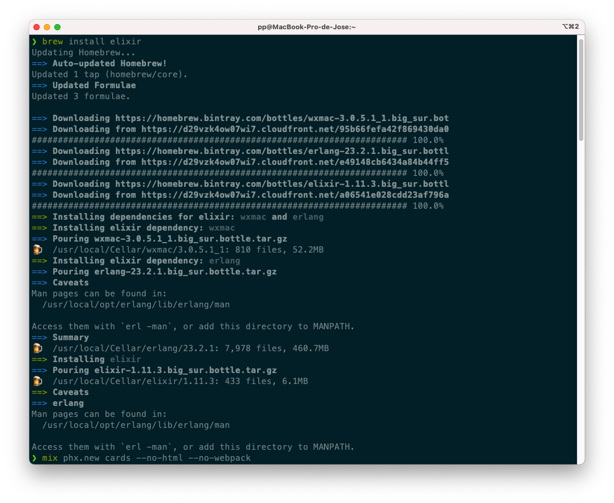
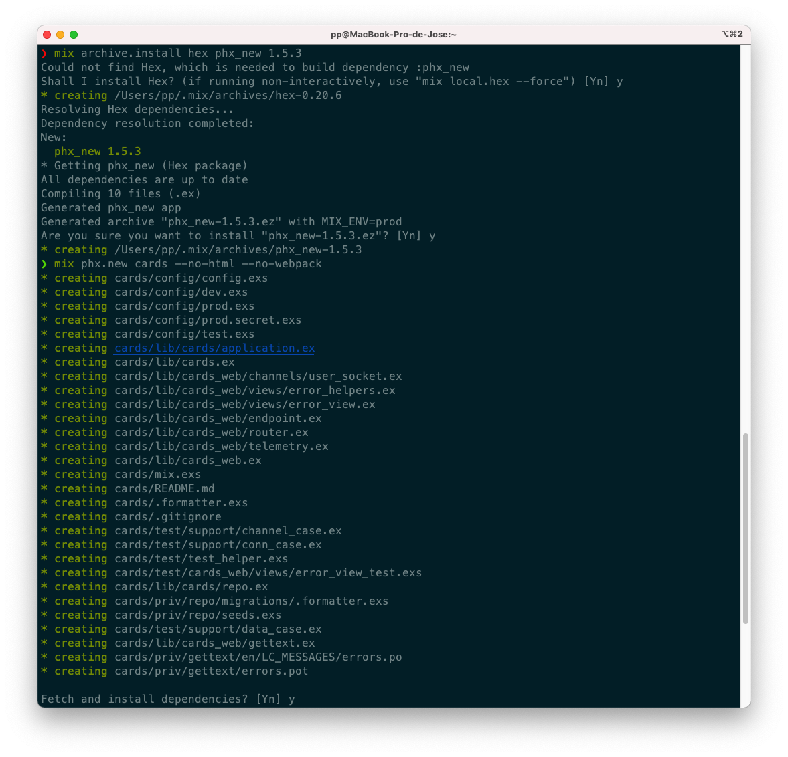
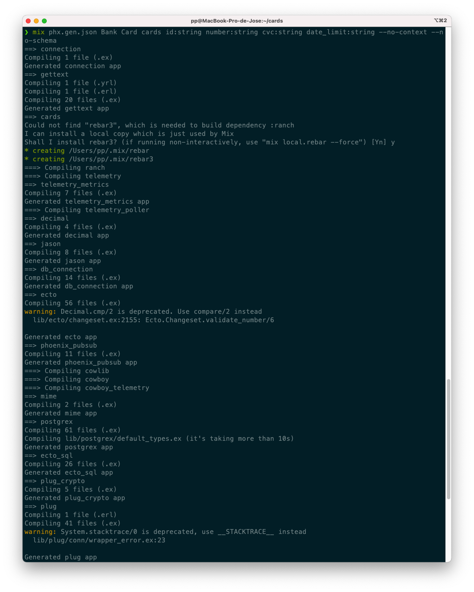
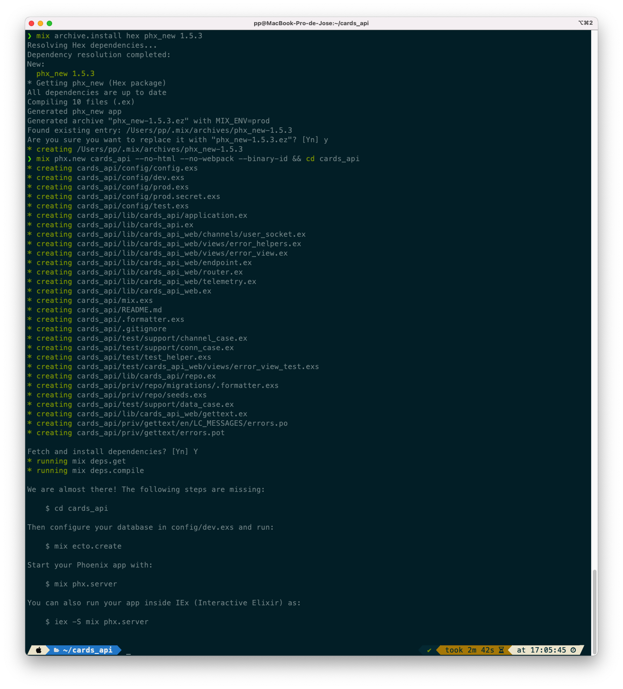
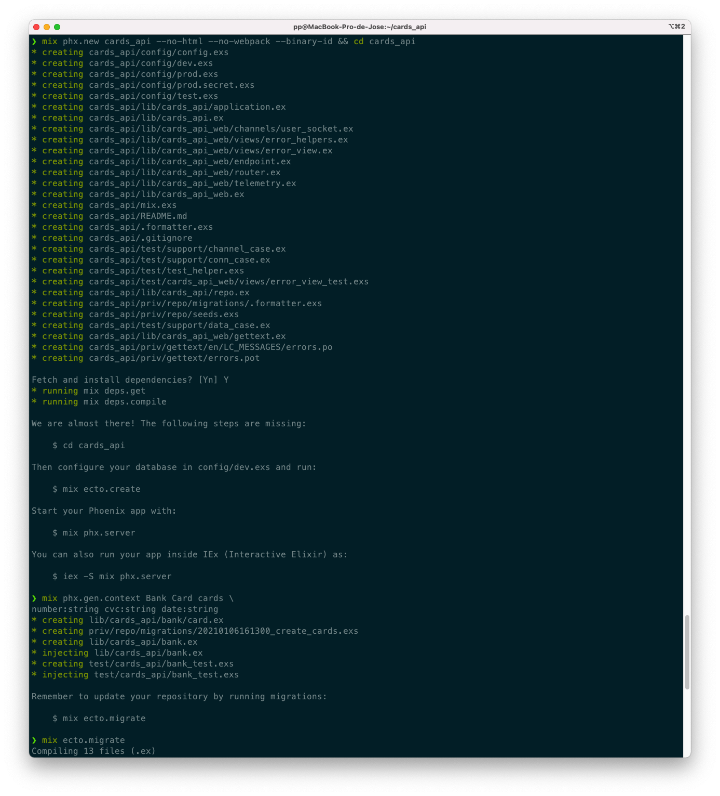
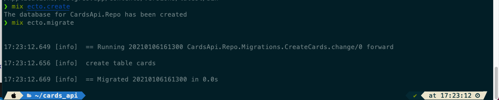
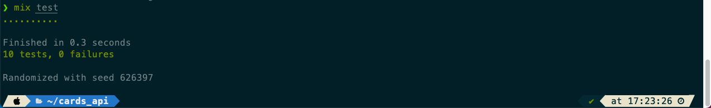
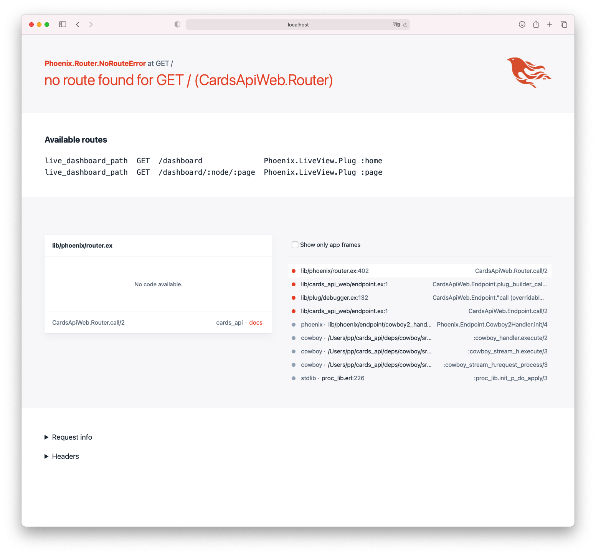
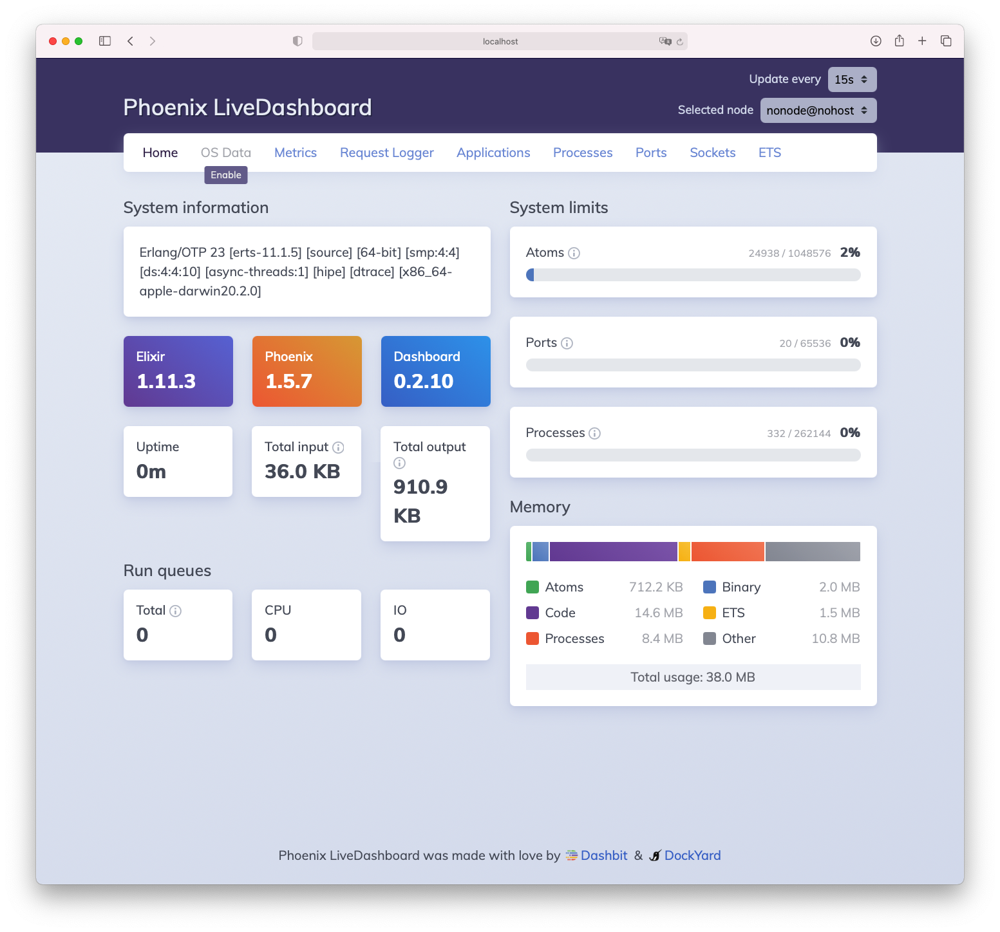

# R4 and R5. Correctness and Additional work


## Dockerfile to construct every microservice and bring it to production

##### cloudbanking-users (core)
```Dockerfile
FROM rust:1.47.0 as builder


WORKDIR /rust


RUN mkdir -p /rust/app/
WORKDIR     /rust/app

COPY ./Cargo.toml ./Cargo.lock ./
COPY ./.env ./
COPY src ./src
RUN cargo build --release --manifest-path=./Cargo.toml --bin cloudbanking


FROM rust:1.47.0 as runner
COPY  --from=builder /rust/app/target/release/cloudbanking /app/core
COPY  --from=builder /rust/app/.env ./app
EXPOSE 3030 3031 3032 3033

WORKDIR /app
CMD ["./core"]
```


##### cloudbanking-account
```Dockerfile
FROM rust:1.47.0 as builder


WORKDIR /rust


RUN mkdir -p /rust/app/account/src/bankaccount_module
WORKDIR     /rust/app

COPY ./account/Cargo.toml ./account
COPY ./account/.env ./account
COPY ./account/src ./account/src
COPY ./account/src/bankaccount_module ./account/src/bankaccount_module
RUN cargo build --release --manifest-path=./account/Cargo.toml --bin account


FROM rust:1.47.0 as runner
COPY  --from=builder /rust/app/account/target/release/account /app/account
COPY  --from=builder /rust/app/account/.env ./app
EXPOSE 3030 3031 3032 3033

WORKDIR /app
CMD ["./account"]
```


##### cloudbanking-cards

```Dockerfile
FROM nimlang/nim:onbuild

COPY ./ ./
CMD nimble build

ENTRYPOINT ["./bin/jester_cards"]
```


##### cloudbanking-funds

```Dockerfile
FROM registry.access.redhat.com/ubi8/ubi-minimal:8.3
WORKDIR /work/
RUN chown 1001 /work \
    && chmod "g+rwX" /work \
    && chown 1001:root /work
COPY --chown=1001:root target/*-runner /work/application

EXPOSE 8080
USER 1001

CMD ["./application", "-Dquarkus.http.host=0.0.0.0"]
```


## Multi-container production


```Dockerfile
version: "3"
services:
  # Main Microservice. That expose /api
  cloudbanking-core:
    # Name of container to create
    container_name: cloudbanking-core
    # The file is in . and the dockerfile is Dockerfile.core
    build:
      context: .
      dockerfile: Dockerfile.core
    # Exposing port 3030 
    ports:
      - "3030:3030"
    depends_on:
      - cloudbanking-account
      - cloudbanking-card
      - cloudbanking-funds

    # Creating a network. It will be useful for connecting
    # multiple microservices here
    networks:
      - proxynet
    extra_hosts:
      # To comunicate host with docker container
      - "host.docker.internal:host-gateway"

  cloudbanking-account:
    container_name: cloudbanking-account
    build: 
      context: .
      dockerfile: Dockerfile.account
    ports:
      - "3031:3031"
    networks:
      - proxynet
    extra_hosts:
      - "host.docker.internal:host-gateway"

  cloudbanking-card:
    container_name: cloudbanking-card
    build: 
      context: ./card
      dockerfile: Dockerfile.cards
    ports:
      - "3032:3032"
    networks:
      - proxynet
    extra_hosts:
      - "host.docker.internal:host-gateway"

  cloudbanking-funds:
    container_name: cloudbanking-funds
    image: pepitoenpeligro/cloudbanking-funds
    ports:
      - "3033:3033"
    networks:
      - proxynet
    extra_hosts:
      - "host.docker.internal:host-gateway"


networks:
  proxynet:
    name: custom_network
```


## Code Advance

[HU 3 - Add investment fund as customer user](https://github.com/pepitoenpeligro/cloudbanking/issues/15)
[HU 6 - Delete fund investment as customer user](https://github.com/pepitoenpeligro/cloudbanking/issues/18)

Defining model:

```kotlin
package com.pepe.rest.resteasyjackson

class Fund{
    var id: String? = null
    var amount: Float? =  0.0f
    var dateStart: String? = null
    var dateEnd:   String? = null
    var status: Boolean? = false

    constructor() {}

    constructor(id: String?, amount: Float?, dateStart: String?, dateEnd: String?, status: Boolean?){
        this.id = id
        this.amount = amount
        this.dateStart = dateStart
        this.dateEnd = dateEnd
        this.status = status
    }
}
```

The object mapper (for json exchange)

```kotlin
@Singleton
class MyObjectMapperCustomizer : ObjectMapperCustomizer {
    override fun customize(objectMapper: ObjectMapper) {
        // To suppress serializing properties with null values
        objectMapper.setSerializationInclusion(JsonInclude.Include.NON_NULL)
    }
}
```


The definition of the microservice that includes the fulfillment of both user stories:


```kotlin
package com.pepe.rest.resteasyjackson
import javax.inject.Inject
import javax.enterprise.inject.Default
import javax.enterprise.context.ApplicationScoped
import javax.ws.rs.core.Response.*
import javax.ws.rs.core.Response
import org.jboss.logging.Logger


import java.util.*
import javax.ws.rs.*
import javax.ws.rs.core.MediaType
import java.time.LocalDateTime


// ./mvnw compile quarkus:dev
@ApplicationScoped
class FundService {

    private val funds = Collections.newSetFromMap(Collections.synchronizedMap(LinkedHashMap<Fund, Boolean>()))


    fun greeting(name: String): String {
        return "hello $name"
    }

    fun addFund(f: Fund): Boolean{
        return funds.add(f)

    }


    fun getFunds(): Set<Fund>{
        return funds
    }

    fun deleteFund(id: String): Boolean{
        funds.removeIf {  existingFund:    Fund -> existingFund.id!!.contentEquals(id!!) }
        return true
    }


}

@Path("/")
@Produces(MediaType.APPLICATION_JSON)
@Consumes(MediaType.APPLICATION_JSON)
class FundResource {

    companion object {
        private val LOG = Logger.getLogger(FundResource::class.java)

    }

    @Inject
    @field: Default 
    lateinit var service: FundService

    // Get all funds
    @GET
    @Produces(MediaType.APPLICATION_JSON)
    @Path("/funds")
    fun list():  Set<Fund> {
        LOG.info("GET -> returning funds")
        return service.getFunds()
    }

    // Creates one funds
    @POST
    @Path("/funds")
    fun  add(f: Fund): Response {
        val result = service.addFund(f)
        if(result){
            LOG.info("POST -> Fund was created")
            var m  = Message("Created", "Fund was created");
            return Response.status(Response.Status.ACCEPTED).entity(m).build();
        }
        LOG.info("POST -> Fund was NOT created")
        var m  = Message("Not Created", "Fund was not created");
        return Response.status(Response.Status.BAD_REQUEST).entity(m).build();

    }

    // Deletes one funds
    @DELETE
    @Path("/funds/{id}")
    fun delete(@PathParam("id") id: String): Boolean{
        LOG.info("DELETE -> Fund was deleted")
        return service.deleteFund(id)
    }

}
```

## Benchmarking

### Funds Microservice (kotlin-quarkus)

##### WRK


##### Taurus (JMeter)


You can find the original video (.mov) in  https://user-images.githubusercontent.com/14912971/104126932-99aa3780-535f-11eb-9016-be4826f90b10.mov


### Users Microservice (rust-actix)

##### WRK


##### Taurus (JMeter)


You can find the original video (.mov) in https://user-images.githubusercontent.com/14912971/104126945-a7f85380-535f-11eb-960e-afe8f77fc08a.mov


## Development attempt with Elixir (absolute failure)










