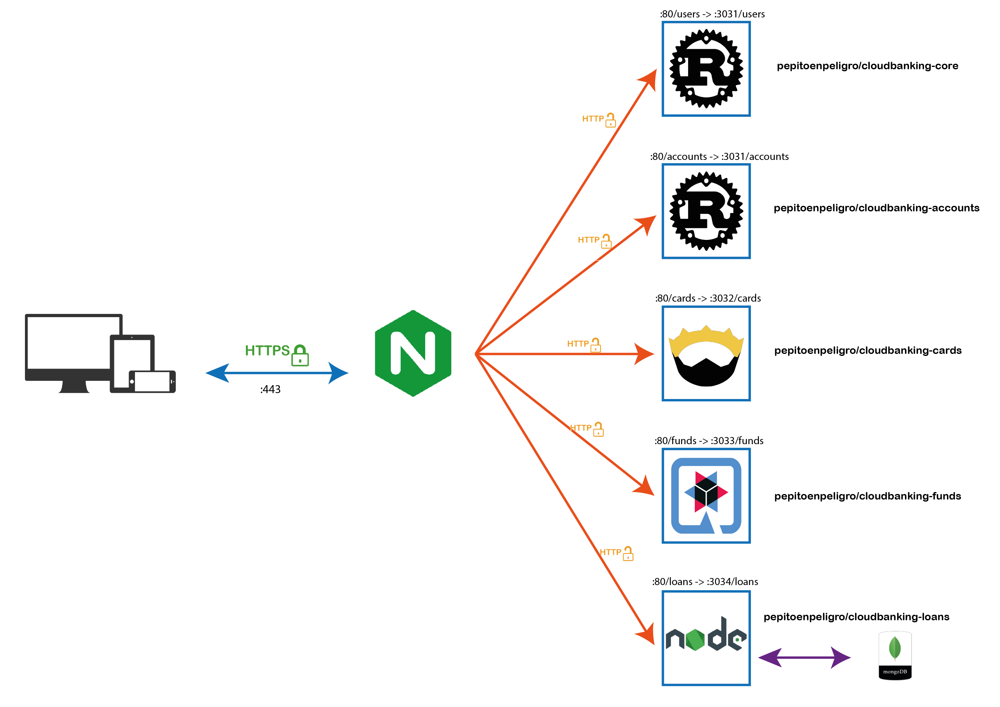
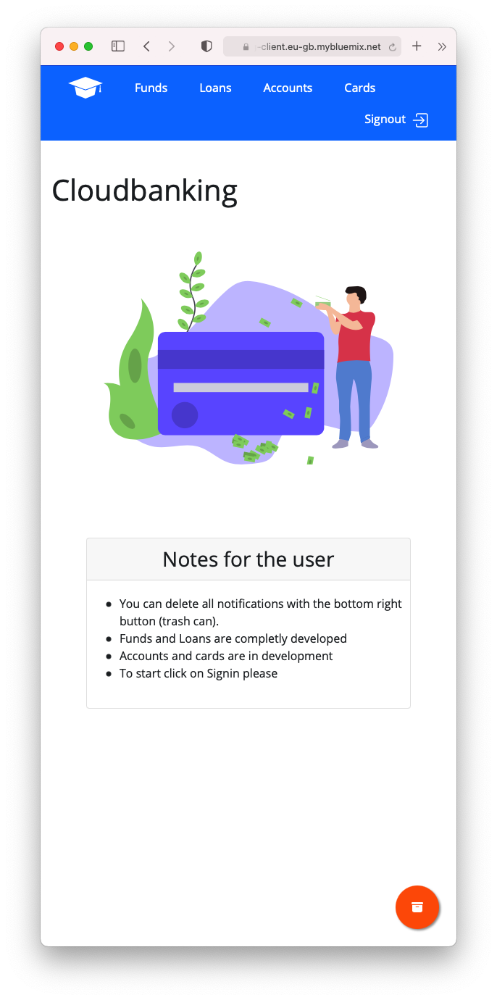
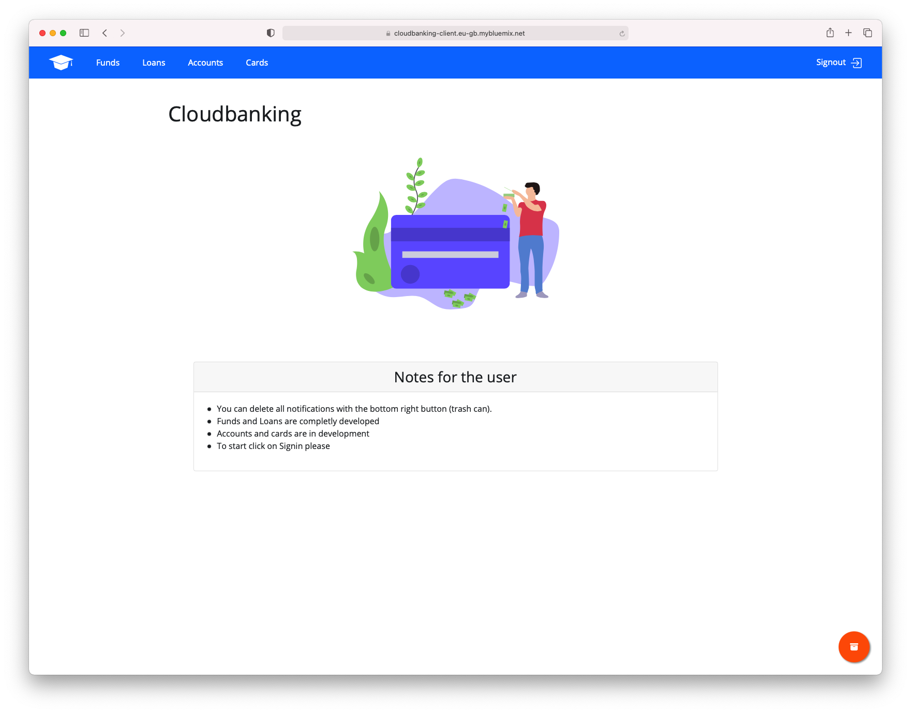
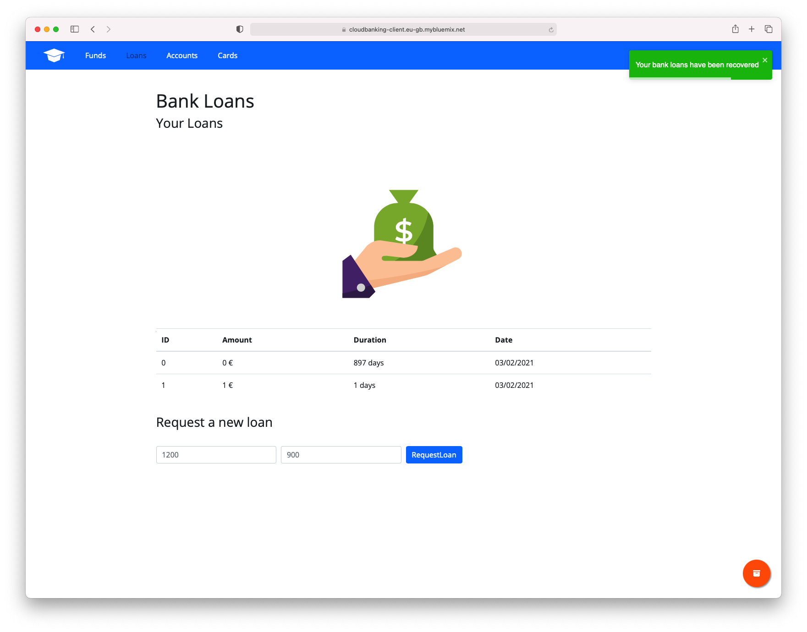
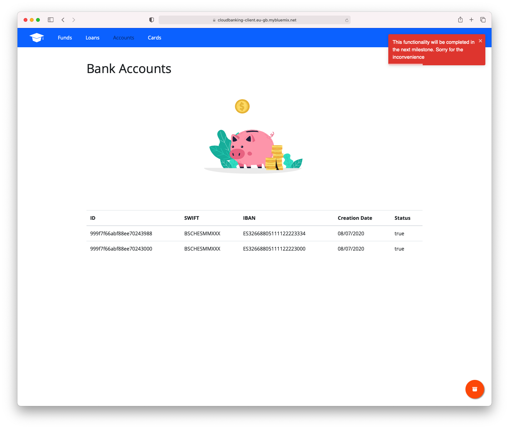
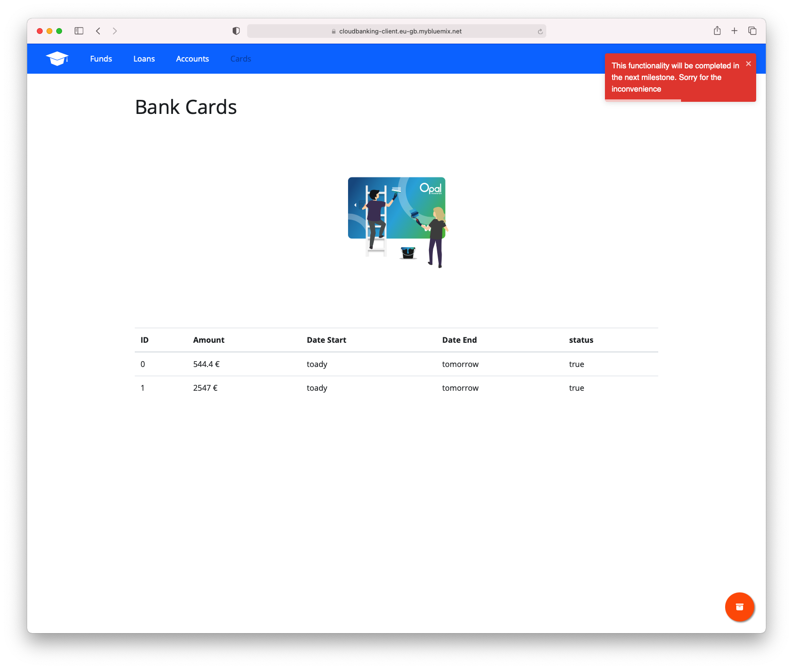

# Design, structure and justification of Cloudbanking-cluster

As a picture is worth a thousand words, I show a diagram summarizing the drop-down services and their interaction.



We have five microservices. The way they are described are practically identical.

Let's focus on card microservices. In the past, we used to build the image locally. Images related to microservices built with Rust are excessively slow, then consuming at deployment time makes the continuous delivery process extremely slow. For this reason we have automated the generation of the microservices and we obtain directly the image already built (we gain performance, but we spend more bandwidth).

```yaml
cloudbanking-account:
    container_name: cloudbanking-account
    # Image updated automaticly with Githubaction
    image: pepitoenpeligro/cloudbanking-account
    # build:
    #   context: .
    #   dockerfile: Dockerfile.account
    ports:
      - "3031:3031"
    networks:
      - proxynet
    extra_hosts:
      - "host.docker.internal:host-gateway"
```


We expose port 3031 and connect all the microservices to the same network called "proxynet" so that they are all connected to each other and we add a connection to the host (to the machine that deploys the s cluster).


```yaml
networks:
  proxynet:
    name: custom_network
```


As we have seen in the image above, there is an instance of Nginx running as a reverse proxy. We have avoided exposing our microservices directly and we have introduced an intermediate agent (Nginx) which is the one that captures all the http and https requests and then redirects the appropriate requests to each microservice and sends the response to the client with what the responding microservice has generated.


```yaml
nginx:
    image: nginx:alpine
    ports:
        - 80:80
        - 443:443
    volumes:
        - $PWD/conf/nginx.conf:/etc/nginx/conf.d/default.conf
        - ./data/certbot/conf:/etc/letsencrypt
        - ./data/certbot/www:/var/www/certbot
        - /etc/letsencrypt/live/pepecordoba.site/fullchain.pem:/etc/letsencrypt/live/pepecordoba.site/fullchain.pem
        - /etc/letsencrypt/live/pepecordoba.site/privkey.pem:/etc/letsencrypt/live/pepecordoba.site/privkey.pem
    depends_on:
        - cloudbanking-core
    networks:
        - proxynet
    extra_hosts:
        - "host.docker.internal:host-gateway"
    command: "/bin/sh -c 'while :; do sleep 6h & wait $${!}; nginx -s reload; done & nginx -g \"daemon off;\"'"
```


As an additional aspect, it has been provided with SSL certificates generated with lets encrypt and certbot.

It should be noted that we have replaced the CMD (originally described in [DigitalOcean](https://www.digitalocean.com/community/tutorials/how-to-secure-a-containerized-node-js-application-with-nginx-let-s-encrypt-and-docker-compose-es)) so that the regeneration of certificates takes effect both in the Nginx service and each time it generates the "certbot" certificates.

```yaml
  certbot:
    image: certbot/certbot
    restart: unless-stopped
    volumes:
      - ./data/certbot/conf:/etc/letsencrypt
      - ./data/certbot/www:/var/www/certbot
    entrypoint: "/bin/sh -c 'trap exit TERM; while :; do certbot renew; sleep 12h & wait $${!}; done;'"
```


Additionally, a new microservice has been created that is responsible for managing a new entity called bank loan, responding to user stories [#83](https://github.com/pepitoenpeligro/cloudbanking/issues/83) and [#84](https://github.com/pepitoenpeligro/cloudbanking/issues/83)


For the bank loan microservice, we have chosen to add persistence to the data. For this purpose, a "mongo" service has been added.

We have connected this service to the network of the other microservices and specified environment variables necessary to use the container such as the root user name and password, the database name and the listening port (default).


Initially we did not connect the database to the host network, but for debugging purposes, we later considered connecting it so that we could remotely connect to Mongo Compass and view the contents of the database.

```yaml
  database:
    image: mongo:3.2
    container_name: mongo
    restart: unless-stopped
    environment:
      MONGODB_USER: pepito
      MONGODB_PASS: pepitopass
      MONGO_INITDB_ROOT_USERNAME: pepito
      MONGO_INITDB_ROOT_PASSWORD: pepitopass
      MONGODB_DATABASE: loans
      MONGODB_PORT_NUMBER: 27017
    ports:
      - "27017:27017"
    volumes:
      - ./data:/data/db
    networks:
      - proxynet
    extra_hosts:
      - "host.docker.internal:host-gateway"
```


The githubaction that automates the building and updating of images in DockerHub can be found at: [cloudbanking/.github/workflows/ci_docker_builds_push.yml](https://github.com/pepitoenpeligro/cloudbanking/blob/master/.github/workflows/ci_docker_builds_push.yml)

```yaml
name: CI Docker Build and Push

on:
  # Triggers the workflow on push or pull request events but only for the master branch
  workflow_run:
    workflows: ["Continuous Integration Tests"]
    branches: [master]
    paths:
      - 'src/**'
      - 'account/**'
      - 'card/**'
      - 'conf/**'
      - 'funds/**'
      - 'loans/**'
      - 'docker-compose.yml'
      - 'Dockerfile'
      - 'Cargo.toml'
      - 'makefile'
      - 'Dockerfile.account'
      - 'Dockerfile.card'
      - 'Dockerfile.core'
    types: 
      - completed

  workflow_dispatch:

jobs:
  buildCore:
    runs-on: ubuntu-latest
    steps:
      - name: Checkout
        uses: actions/checkout@v2

      - name: Set up QEMU
        uses: docker/setup-qemu-action@v1

      - name: Set up Docker Buildx
        uses: docker/setup-buildx-action@v1

      - name: Login to DockerHub
        uses: docker/login-action@v1 
        with:
          username: ${{ secrets.DOCKERHUB_USERNAME }}
          password: ${{ secrets.DOCKERHUB_TOKEN }}

      - name: Build and push 
        id: docker_build
        uses: docker/build-push-action@v2
        with:
          push: true
          tags: pepitoenpeligro/cloudbanking-core
          context: .
          file: ./Dockerfile.core

      - name: Image digest
        run: echo ${{ steps.docker_build.outputs.digest }}


  buildAccounts:
    runs-on: ubuntu-latest
    steps:
      - name: Checkout
        uses: actions/checkout@v2

      - name: Set up QEMU
        uses: docker/setup-qemu-action@v1

      - name: Set up Docker Buildx
        uses: docker/setup-buildx-action@v1

      - name: Login to DockerHub
        uses: docker/login-action@v1 
        with:
          username: ${{ secrets.DOCKERHUB_USERNAME }}
          password: ${{ secrets.DOCKERHUB_TOKEN }}

      - name: Build and push 
        id: docker_build
        uses: docker/build-push-action@v2
        with:
          push: true
          tags: pepitoenpeligro/cloudbanking-account
          context: .
          file: ./Dockerfile.account

      - name: Image digest
        run: echo ${{ steps.docker_build.outputs.digest }}


  buildCards:
    runs-on: ubuntu-latest
    steps:
      - name: Checkout
        uses: actions/checkout@v2

      - name: Set up QEMU
        uses: docker/setup-qemu-action@v1

      - name: Set up Docker Buildx
        uses: docker/setup-buildx-action@v1

      - name: Login to DockerHub
        uses: docker/login-action@v1 
        with:
          username: ${{ secrets.DOCKERHUB_USERNAME }}
          password: ${{ secrets.DOCKERHUB_TOKEN }}

      - name: Build and push 
        id: docker_build
        uses: docker/build-push-action@v2
        with:
          push: true
          tags: pepitoenpeligro/cloudbanking-cards
          context: ./card
          file: ./card/Dockerfile.cards

      - name: Image digest
        run: echo ${{ steps.docker_build.outputs.digest }}


  buildLoans:
    runs-on: ubuntu-latest
    steps:
      - name: Checkout
        uses: actions/checkout@v2

      - name: Set up QEMU
        uses: docker/setup-qemu-action@v1

      - name: Set up Docker Buildx
        uses: docker/setup-buildx-action@v1

      - name: Login to DockerHub
        uses: docker/login-action@v1 
        with:
          username: ${{ secrets.DOCKERHUB_USERNAME }}
          password: ${{ secrets.DOCKERHUB_TOKEN }}

      - name: Build and push 
        id: docker_build
        uses: docker/build-push-action@v2
        with:
          push: true
          tags: pepitoenpeligro/cloudbanking-loans
          context: ./loans
          file: ./loans/loans.Dockerfile

      - name: Image digest
        run: echo ${{ steps.docker_build.outputs.digest }}
```

# Additional Work. Reproducible provisioning, integration and continuous and automatic deployment.


#### Reproducible provisioning

** [Based in Exercise 2: Get a test account on OpenStack and create an instance that can be accessed, provisioning it with some available script ](https://github.com/pepitoenpeligro/CC-Ejercicios/blob/master/06.md#ejercicio-2) ** 

Videos have been made on the execution of this entire section. They can be found and reproduced in issue [#79](https://github.com/pepitoenpeligro/cloudbanking/issues/79).

**All was provisioned in OVH Public Cloud over OpenStack**

```ruby
require 'vagrant-openstack-provider'

 
Vagrant.configure('2') do |config|

  #SSH forward port 22 -> 2222
  config.vm.network "forwarded_port", guest: 22, host:2222, id: "ssh", auto_correct: true

  #Expose port 80 -> 8080 for web Service (future)
  config.vm.network "forwarded_port", guest: 80, host:80, id: "webnormal", auto_correct: true

  #Expose port 80 -> 8080 for web Service (future)
  config.vm.network "forwarded_port", guest: 8080, host:8080, id: "webnormaldos", auto_correct: true

  #Expose port 80 -> 8080 for web Service (future)
  config.vm.network "forwarded_port", guest: 443, host:443, id: "websecure", auto_correct: true
  
  #Expose port 3030 -> 3030 for api Service (future)
  config.vm.network "forwarded_port", guest: 3030, host:3030, id: "service1", auto_correct: true

  #Expose port 3031 -> 3031 for api Service (future)
  config.vm.network "forwarded_port", guest: 3031, host:3031, id: "service2", auto_correct: true

  #Expose port 3032 -> 3032 for api Service (future)
  config.vm.network "forwarded_port", guest: 3032, host:3032, id: "service3", auto_correct: true

  #Expose port 3033 -> 3033 for api Service (future)
  config.vm.network "forwarded_port", guest: 3033, host:3033, id: "service4", auto_correct: true

  
  config.vm.define :'vagrant-ubuntu' do |v|
 
    v.ssh.username = 'ubuntu'
    v.ssh.private_key_path = '~/.ssh/ovh'
    v.ssh.insert_key = 'false'
    v.vm.synced_folder '.', '/vagrant', type: 'rsync', disabled: true
    v.vm.provider :openstack do |provider|
      provider.openstack_auth_url    = ENV['OS_AUTH_URL']
      provider.openstack_network_url = 'https://network.compute.uk1.cloud.ovh.net/v2.0'
      provider.identity_api_version  = ENV['OS_IDENTITY_API_VERSION']
      provider.username              = ENV['OS_USERNAME']
      provider.password              = ENV['OS_PASSWORD']
      provider.domain_name           = ENV['OS_USER_DOMAIN_NAME']
      provider.project_name          = ENV['OS_PROJECT_NAME']
      provider.tenant_name           = ENV['OS_TENANT_NAME']
      provider.project_domain_name   = ENV['OS_USER_DOMAIN_NAME']
      provider.flavor                = 's1-4'
      provider.image                 = 'Ubuntu 18.04'
      provider.keypair_name          = 'ovh'
      provider.region                = ENV['OS_REGION_NAME']
      provider.networks              = [ 'Ext-Net' ]
    end
  end

  config.vm.provision :ansible do |ansible|
    ansible.limit = "all"
    ansible.playbook = "provision.yaml"
    # ansible.verbose = "v"
  end
end
```


The Vagrantfile (cloudbanking/Vagrantfile) provisioning file has been modeled (I would like to do this in the future with Terraform).


An ansible playbook (cloudbanking/provision.yaml) has been created so that when the infrastructure is finished, the machine is automatically configured. Our configuration management is basic and consists of updating the repositories, installing docker, docker-compose and adding the necessary permissions to run docker without sudo.


```yaml
---
- hosts: all
  user: pepitoenpeligro
  become: yes

  vars:
    - packages: ['build-essential', 'git', 'apt-transport-https', 'ca-certificates', 'curl', 'software-properties-common', 'dkms', 'wget', 'unzip']
    - project_location: /home/pepitoenpeligro

  tasks:
  - name: Say hi
    shell: echo "hi"!

  - name: Remove locks
    shell: rm -f /var/lib/apt/lists/lock && rm -f /var/lib/dpkg/lock && rm -f /var/cache/apt/archives/lock && rm -rf /var/lib/dpkg/lock-frontend

  - name: Update APT Cache
    apt:
      update_cache: yes
      force_apt_get: yes  

  - name: Get gpg docker.
    shell: curl -fsSL https://download.docker.com/linux/ubuntu/gpg | apt-key add -

  - name: Add repository.
    shell: add-apt-repository "deb [arch=amd64] https://download.docker.com/linux/ubuntu $(lsb_release -cs) stable" && apt update
  
  - name: Remove locks
    shell: rm -f /var/lib/apt/lists/lock && rm -f /var/lib/dpkg/lock && rm -f /var/cache/apt/archives/lock && rm -rf /var/lib/dpkg/lock-frontend


  - name: Install Docker.
    become_user: root
    shell: apt-get install docker-ce -y


  - name: Make User docker
    become_user: root
    shell: gpasswd -a ubuntu docker

  - name: Docker service start
    service:
      name: docker
      state: started
  
  # wget https://github.com/docker/compose/releases/download/1.28.2/docker-compose-Linux-x86_64 -O /usr/local/bin/docker-compose
  # chmod u+x /usr/local/bin/docker-compose
  - name: Install Docker Compose
    get_url:
      url: https://github.com/docker/compose/releases/download/1.28.2/docker-compose-Linux-x86_64
      dest: /usr/local/bin/docker-compose
      mode: 0755
```


<video
src="https://user-images.githubusercontent.com/14912971/106393386-14162680-63f7-11eb-8f5b-483e03ea6e85.mp4">
</video>


<video
src="https://user-images.githubusercontent.com/14912971/106393411-3d36b700-63f7-11eb-825a-c6c0e293ac3f.mp4">
</video>


<video
src="https://user-images.githubusercontent.com/14912971/106393936-234aa380-63fa-11eb-9fbd-3a7091999f1f.mp4">
</video>


### Continuous Deployment (Automatic)


We have developed a GHAction (cloudbanking/.github/workflows/cd_servers.yml) so that the deployment of our service is automated on the previously provisioned production server. This task is repetitive, and therefore, it is very convenient to have it automated to minimize delivery times to the customer.

```yaml
# This is a basic workflow to help you get started with Actions

name: "Continuous Delivery Microservices"

# Controls when the action will run. 
on:
  # Triggers the workflow on push or pull request events but only for the master branch
  workflow_run:
    workflows: ["Continuous Integration Tests"]
    branches: [master]
    paths:
      - 'src/**'
      - 'account/**'
      - 'card/**'
      - 'conf/**'
      - 'funds/**'
      - 'loans/**'
      - 'docker-compose.yml'
      - 'Dockerfile'
      - 'Cargo.toml'
      - 'makefile'
      - 'Dockerfile.account'
      - 'Dockerfile.card'
      - 'Dockerfile.core'
    types: 
      - completed

  workflow_dispatch:


jobs:
  deploy:

    runs-on: ubuntu-latest
    # Timeout of 30 minutes to deploy with docker-compose
    timeout-minutes: 30


    steps:

      - uses: actions/checkout@v2
      
      
      - uses: appleboy/ssh-action@master
        with:
          host: ${{ secrets.SSH_HOST }}
          username: ${{ secrets.SSH_USER }}
          password: ${{ secrets.SSH_SECRET }}
          #key: ${{ secrets.SSH_KEY }}
          port: 22
          script: |
            whoami
            pwd
            echo "Geting remote ls"
            ls -al
            echo "Remove files remote and clone repo"
            docker-compose down -v && rm -rf cloudbanking/ && git clone https://github.com/pepitoenpeligro/cloudbanking/
            cd cloudbanking/
            ls -al
            pwd
            echo "Build and compose containers"
            docker-compose up -d 
            echo "[Delivery] END"
```


Additionally, we have created a battery of tests to check, after deployment, that our microservices and framework are working properly.


```yaml
name: "Continuous Delivery Test Check Microservices"

# Controls when the action will run. 
on:

  workflow_run:
    workflows: ["Continuous Delivery Microservices"]
    branches: [master]
    paths:
      - 'src/**'
      - 'account/**'
      - 'card/**'
      - 'conf/**'
      - 'funds/**'
      - 'loans/**'
      - 'docker-compose.yml'
      - 'Dockerfile'
      - 'Cargo.toml'
      - 'makefile'
      - 'Dockerfile.account'
      - 'Dockerfile.card'
      - 'Dockerfile.core'
    types: 
      - completed

  workflow_dispatch:


jobs:
  deploy:

    runs-on: ubuntu-latest
    # Timeout of 30 minutes to deploy with docker-compose
    timeout-minutes: 30


    steps:

      - uses: actions/checkout@v2
      
      - name: Install jq
        run: |
          sudo apt-get install jq -y 
      
      - name: Download api-test
        run: |
          curl -LJO https://raw.githubusercontent.com/subeshb1/api-test/master/api-test.sh
          chmod +x api-test.sh
      - name: Test Remote Docker-Compose
        run: |
          echo "Running api test"
          ./api-test.sh -f  test-cases.json describe && ./api-test.sh -f  test-cases.json run all && ./api-test.sh -f test-cases.json test all
          echo "Api rest test finished"
```


The file describing the proposed tests to check that the deployment has been performed correctly can be found in [cloudbanking/test-cases.json](https://github.com/pepitoenpeligro/cloudbanking/blob/master/test-cases.json)

```yaml

{
    "name": "Cloudbanking Microservices test",
    "testCases": {
      "postfunds": {
        "path": "/funds",
        "body": {
          
          "id" : 9898,
          "amount": 85,
          "dateStart": "toady",
          "dateEnd": "tomorrow",
          "status": true
        },
        "header": {
          "Content-Type": "application/json"
        },
        "method": "POST"
      },
  
      "getfunds": {
        "path": "/funds",
        "method": "GET",
        "description": "Get all Bank funds",
        "expect": {
          "body": {
            "contains": [{
              "id": "9898"
            }]
          }
        }
      }
      
  
    },
    "url": "pepecordoba.site:80",
    "header": {
      "Content-Type": "application/json"
    }
  }
```


### Cloudbanking React Client

A small client has been developed on React and axios (to make the requests to our api) which can be found fully operational at [[Cloudbanking](https://cloudbanking-client.eu-gb.mybluemix.net)](https://cloudbanking-client.eu-gb.mybluemix.net)


All source code can be found at [cloudbanking/client](https://github.com/pepitoenpeligro/cloudbanking/tree/master/client)

The application was deployed on IBM Cloudfoundry (former IBM blue mix).

For this purpose, it has been defined in the manifest:

```yml
---
applications:
  - name: cloudbanking-client
    memory: 512Mb
    command: npm start
```


The routes in app could be:


```javascript
const Routes = () => {
    return(
        <BrowserRouter>
            <Switch>
                <Route exact path="/" component={App} />
                <Route path="/signin" component={Signin} />
                <Route path="/bankaccounts" component={BankAccounts} />
                <Route path="/bankcards" component={BankCards} />
                <Route path="/bankfunds" component={BankFunds} />
                <Route path="/bankloans" component={BankLoans} />
            </Switch>
        </BrowserRouter>
    )
};
```


Let's explain the "BankLoans" component (the most recent one).

A new component called BankLoans has been defined. Inside we set state variables of our component. We keep a list of bank loans, a switch to know when to show those loans (once loaded from the api), and two variables to collect form values.

```javascript
const BankLoans = ({ history }) => {
  const [values, setValues] = useState({
    loans: [],
    loansVisible: false,
    inputAmount: "",
    inputDuration: "",
  });

  ... 
}
```


At the beginning of the component's life cycle we make a request to our api (the url is blackened in our dotenv file). We answer in the callback of the request and save the values received from the api (in case of affirmative answer). If during the request there was any error, we inform the user with element of type "toast".

```javascript
const BankLoans = ({ history }) => {
  
  ...


   React.useEffect(() => {
    axios({
      method: "GET",
      url: `${process.env.REACT_APP_API}/loans`,
      headers: {
        "Content-Type": "application/json",
        Accept: "application/json",
      },
    }).then(function (response) {
      console.log(response);
      console.log(response.data);
      setValues((values) => ({
        ...values,
        loans: response.data,
        loansVisible: true,
      }));
      console.log("Loans object");
      console.log(loans);
      toast.success("Your bank loans have been recovered");
    });
    // eslint-disable-next-line react-hooks/exhaustive-deps
  }, []);


  ...
}

```


We create a form to process post requests to our api (create a new bank loan)

```javascript
const BankLoans = ({ history }) => {

...

const generateNewLoanView = (event) => {
    return (
      <RB.Form onSubmit={processMicroserviceRequest}>
        <RB.Form.Row className="align-items-center">
          <RB.Col sm={3} className="my-1">
            <RB.Form.Label htmlFor="inputAmount" srOnly>
              Amount
            </RB.Form.Label>
            <RB.Form.Control
              id="inputAmount"
              onChange={(event) =>
                setValues({ ...values, inputAmount: event.target.value })
              }
              placeholder="1200"
            />
          </RB.Col>

          <RB.Col sm={3} className="my-1">
            <RB.Form.Label htmlFor="inputduration" srOnly>
              Duration
            </RB.Form.Label>
            <RB.Form.Control
              id="inputDuration"
              onChange={(event) =>
                setValues({ ...values, inputDuration: event.target.value })
              }
              placeholder="900"
            />
          </RB.Col>

          <RB.Col xs="auto" className="my-1">
            <RB.Button type="submit">RequestLoan</RB.Button>
          </RB.Col>
        </RB.Form.Row>
      </RB.Form>
    );
  };

...


}
```


Finally we define the block in which we are going to display the bank loans table. When the "loansVisible" switch is activated, the table is rendered. 


The most important aspect of this section is that we generate a *\<tr\>* and *\<td\>* block for each element in the bank loan array.

```javascript
const BankLoans = ({ history }) => {
...
  const generateBankLoansView = (event) => {
      if (!loansVisible) {
        return (
          <p>We are loading your loans, please wait until this message changes</p>
        );
      } else {
        console.log("Estare bien?");
        console.log(loans);
        return (
          <div>
            <Table responsive>
              <thead>
                <tr>
                  <th>ID</th>
                  <th>Amount</th>
                  <th>Duration</th>
                  <th>Date</th>
                </tr>
              </thead>
              <tbody>
                {loans.map((item) => (

                  <tr key={item._id}>
                    <td>{item.id}</td>
                    <td>{item.amount + '\t€'}</td>
                    <td>{item.duration + '\tdays'}</td>

            
                    <td>{new Date(item.updatedAt).toLocaleDateString()}</td>
                  </tr>
                ))}
              </tbody>
            </Table>
          </div>
        );
      }
    };

  ...
}

```


Finally, another GitHubAction has been developed to perform an automated deployment on every change on the client folder on the IBM CloudFoundry platform.

```yaml
name: "Continuous Delivery Client React App"
on:
  push:
    branches: [ master ]
    paths:
    - 'client/**'
    
jobs:
  deploy:
    runs-on: ubuntu-latest
    steps:
      - name: Download my repo
        uses: actions/checkout@v2
      - name: Display repo files
        run: |
          cd client
          echo "This is all worflows can see:"
          ls -la 
      - name: Installing ibmcloud CLI
        run: | 
          curl -fsSL https://clis.cloud.ibm.com/install/linux | sh
      - name: Instalo el cliente cloudfoundry de IBM
        run: | 
          ibmcloud cf install
      - name: Do Login in IBMcloud account
        run: |
          ibmcloud login --apikey  ${{ secrets.IBM_CLOUD_API_KEY }} -r eu-gb 
        # Se puede obtener el target con ibmcloud resource groups
      - name: Specificating target where I deploy this repo
        run: |
          echo "You can see organizer email in ibmcloud portal > Manage > IAM Access > Users > CloudFoundry"
          echo "Normally email is your email and space is dev or watever you have in your manifest.yml"
          ibmcloud target -o ${{ secrets.IBM_USER }} -s ${{ secrets.IBM_CLOUD_PROJECT_SPACE }}
      - name: Despliego en Cloud Foundry
        run: |
          ls -la 
          cd client
          ls -la
          echo "Now will be deployed"
          ibmcloud cf push -f $(find . -name "manifest.yml" | head -1)
```


The url of the operating client is: https://cloudbanking-client.eu-gb.mybluemix.net

I will leave the whole operating system in case we want to test it in these days.









## References
1. [sdorsett/Using Vagrant to deploy an OVH public cloud server](https://sdorsett.github.io/post/2018-08-19-using-vagrant-to-deploy-to-ovh-public-cloud/)
2. [pepitoenpeligor/CC-Ejercicios](https://github.com/pepitoenpeligro/CC-Ejercicios/)
3. [Parallels GithubActions](https://dev.to/dwieeb/parallelizing-jest-with-github-actions-20m0)
4. [DigitalOcean Nginx and https](https://www.digitalocean.com/community/tutorials/how-to-secure-a-containerized-node-js-application-with-nginx-let-s-encrypt-and-docker-compose-es)
5. [Nginx and https](https://business-science.github.io/shiny-production-with-aws-book/https-nginx-docker-compose.html)